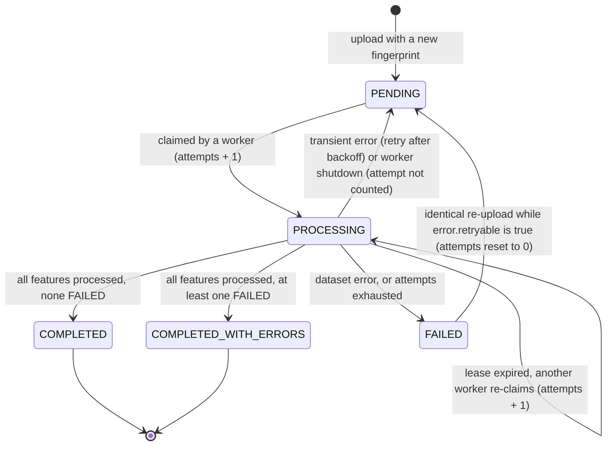

# Files, jobs and service endpoints

The file resource is the hub of the API: it carries the processing status, the dataset summary and links to
the results. Routes: `backend/app/api/routes/files.py`, `jobs.py`, `system.py`. Schemas:
`backend/app/api/schemas.py`. Mapping from rows: `backend/app/api/presenters.py`.

## `GET /api/files/`: list uploads

| Query | Type | Default | Notes |
|---|---|---|---|
| `limit` | int | 20 | 1-100. Out of range: `422 VALIDATION_ERROR` (not clamped). |
| `cursor` | string | | `next_cursor` of the previous page. Malformed: `400 INVALID_CURSOR`. |

Newest first (`created_at` desc, then `id` desc), keyset-paginated. The response is
`{"items": [...], "next_cursor": "<opaque>" | null}`, with no `total`. Each item is a subset of the file
resource: `id`, `filename`, `format`, `size_bytes`, `status`, `feature_count`, `crs`, `created_at`.
Every accepted upload is listed, including deduplication hits (each has its own file `id`). Idempotent replays
create no new entry.

```bash
curl -sS "$BASE/api/files/?limit=10"
curl -sS "$BASE/api/files/?limit=10&cursor=<next_cursor>"
```

## `GET /api/files/{file_id}/`

File information and processing status. Always `200` for an existing file, whatever its status. Errors:
`404 FILE_NOT_FOUND`, `422 VALIDATION_ERROR` when `file_id` is not a UUID.

Captured response for `samples/shapefile/plots_utm43n.zip` (UTM 43N source CRS, measured with the default
`local_equal_area` strategy):

```json
{
  "id": "474b0681-3c4f-4055-9de7-c7e77c5c5b2e",
  "filename": "plots_utm43n.zip",
  "format": "SHAPEFILE",
  "size_bytes": 1476,
  "sha256": "0f2d1c89b206d092a2f40c3b7856c3f08ee85cf92ef3d6078d1d7a4d0d2bd916",
  "status": "COMPLETED",
  "feature_count": 6,
  "crs": "EPSG:32643",
  "crs_name": "WGS 84 / UTM zone 43N",
  "crs_source": "FILE",
  "measurement_strategy": "local_equal_area",
  "summary": {
    "total_features": 6,
    "measured": 6,
    "not_applicable": 0,
    "unsupported": 0,
    "failed": 0,
    "geometry_types": {"Polygon": 6},
    "total_area_m2": 78040.32,
    "total_length_m": null,
    "bbox": [77.209, 28.613899999999997, 77.2177, 28.614900000000006],
    "features_with_z": 0,
    "repaired_features": 0,
    "error_counts": {},
    "issue_counts": {},
    "layers": [{"name": "plots_utm43n", "driver": "ESRI Shapefile", "feature_count": 6}]
  },
  "warnings": [],
  "job": {
    "id": "d81b9ae2-0b3a-42be-a998-26495bee0ea0",
    "status": "COMPLETED",
    "attempts": 1,
    "max_attempts": 3,
    "progress": {"processed_features": 6, "total_features": 6},
    "created_at": "2026-10-08T02:14:28.484561Z",
    "started_at": "2026-10-08T02:14:28.675769Z",
    "finished_at": "2026-10-08T02:14:29.154521Z",
    "duration_ms": 373,
    "error": null
  },
  "created_at": "2026-10-08T02:14:28.484561Z",
  "links": {
    "self": "/api/files/474b0681-3c4f-4055-9de7-c7e77c5c5b2e/",
    "measurements": "/api/files/474b0681-3c4f-4055-9de7-c7e77c5c5b2e/measurements/",
    "features": "/api/files/474b0681-3c4f-4055-9de7-c7e77c5c5b2e/features/",
    "tiles": "/api/files/474b0681-3c4f-4055-9de7-c7e77c5c5b2e/tiles/{z}/{x}/{y}.mvt",
    "job": "/api/jobs/d81b9ae2-0b3a-42be-a998-26495bee0ea0/"
  }
}
```

**Assignment contract.** The assignment's example response is `{id, filename, feature_count, crs, status}`.
All five keys are top-level members with those names, which `tests/api/test_read_api.py::
test_assignment_contract_fields` asserts. Every other member is an addition.

### Fields

| Field | Type | Meaning |
|---|---|---|
| `id` | UUID | This upload. Each upload request gets a new id, even when the job is shared ([deduplication](upload.md#deduplication)). |
| `filename` | string | Client filename, sanitised for display. |
| `format` | `KML` \| `SHAPEFILE` | Detected format. |
| `size_bytes` | int | Size of the uploaded file. |
| `sha256` | string | Hex SHA-256 of the uploaded bytes. |
| `status` | job status | Same as `job.status` ([lifecycle](#job-lifecycle)). |
| `feature_count` | int \| null | Features across all layers. `null` unless `status` is `COMPLETED` or `COMPLETED_WITH_ERRORS`. |
| `crs` | string \| null | Source CRS as `AUTHORITY:CODE` (e.g. `EPSG:32643`). `CUSTOM` if the definition matches no authority code; `null` if the dataset declares none (or an unusable one) and no override was given, and `null` until processing completes. With several layers: the first layer that resolves a CRS. KML layers declare `EPSG:4326`. |
| `crs_name` | string \| null | Human-readable CRS name from PROJ. |
| `crs_source` | `FILE` \| `USER_OVERRIDE` \| null | Declared by the dataset, or the `crs` upload parameter. |
| `measurement_strategy` | `local_equal_area` \| `utm` | Projection strategy for this job (part of the fingerprint). See [../geospatial/crs.md](../geospatial/crs.md). |
| `summary` | object \| null | Dataset summary, computed while streaming. `null` until processing completes (and for `FAILED`). |
| `warnings` | `[{code, message}]` | File-level warnings, see below. `[]` until processing completes. |
| `job` | object | The processing job, see [`GET /api/jobs/{job_id}/`](#get-apijobsjob_id). |
| `created_at` | timestamp | When this upload was accepted. |
| `links` | object | Root-relative URLs: `self`, `measurements`, `features`, `tiles` (URI template with `{z}/{x}/{y}`), `job`. |

### `summary`

| Field | Meaning |
|---|---|
| `total_features` | Features read, across all layers. |
| `measured`, `not_applicable`, `unsupported`, `failed` | Counts per `measurement_status` ([meanings](measurements.md#measurement-status-and-codes)). |
| `geometry_types` | Count per source geometry type. Features without a decodable geometry are counted under `"(none)"`. The summary is stored as JSONB, so key order in this and the other count maps is not meaningful. |
| `total_area_m2` | Sum of the areas of `MEASURED` polygonal features (unrounded values summed, then rounded to 0.01). `null` when no polygon was measured. |
| `total_length_m` | Same for `MEASURED` linear features. `null` when no line was measured. |
| `bbox` | `[min_lon, min_lat, max_lon, max_lat]` in WGS 84 over all features placed in WGS 84; not rounded. `null` if none could be placed (e.g. no CRS). |
| `features_with_z` | Features with Z coordinates (ignored: measurements are 2D). |
| `repaired_features` | Features whose invalid geometry was repaired before measuring. |
| `error_counts` | Count per feature `error.code` (`FAILED` and `UNSUPPORTED` reasons). |
| `issue_counts` | Count per feature issue code. |
| `layers` | `[{name, driver, feature_count}]` per GDAL layer, in read order. |

### `warnings`

| Code | Emitted when |
|---|---|
| `CRS_MISSING` | A layer declares no CRS and no `crs` override was given. Features are stored; polygons and lines fail with `CRS_MISSING`. |
| `CRS_INVALID` | The declared CRS could not be parsed. |
| `CRS_UNSUPPORTED` | The declared CRS has no geographic or projected component. |
| `CRS_OVERRIDDEN` | The `crs` override differs from the CRS the dataset declares. |
| `NO_FEATURES` | The dataset contains no features (`status` is `COMPLETED`, `feature_count` 0). |
| `Z_COORDINATES_IGNORED` | Some features have Z values; measurements are planimetric. |
| `KML_NETWORK_LINKS_IGNORED` | The KML has `<NetworkLink>` elements; their remote content is never fetched. |
| `ZIP_ENTRIES_IGNORED` | Archive entries not used (lists up to 10 names). |
| `UNSUPPORTED_FEATURES` | Some features have geometry types that are not measured. |

Duplicate warnings (same code and message) are removed. Example with `CRS_MISSING`: [upload.md](upload.md#shapefile-without-prj-then-with-a-crs-override).

### Field availability by status

| Field | `PENDING` / `PROCESSING` | `COMPLETED` / `COMPLETED_WITH_ERRORS` | `FAILED` |
|---|---|---|---|
| `feature_count`, `summary` | `null` | set | `null` |
| `crs`, `crs_name`, `crs_source` | `null` | set (`null` if no CRS) | `null` |
| `warnings` | `[]` | list | `[]` |
| results (`measurements/`, `features/`, `tiles/`) | `409 RESULTS_NOT_READY` | `200` | `409 PROCESSING_FAILED` |

## Job lifecycle

A job is the unit of processing. Several file uploads can share one job.



| Status | Terminal | Results | Meaning |
|---|---|---|---|
| `PENDING` | no | no | Queued, or waiting for a retry (`run_after` in the future). |
| `PROCESSING` | no | no | Claimed by a worker holding a lease; `progress.processed_features` grows per batch (5,000 features by default). |
| `COMPLETED` | yes | yes | Every feature processed; no feature `FAILED`. `UNSUPPORTED` and `NOT_APPLICABLE` do not count as failures. |
| `COMPLETED_WITH_ERRORS` | yes | yes | Every feature processed; at least one feature `FAILED` (per-feature isolation, see [../geospatial/geometry-handling.md](../geospatial/geometry-handling.md)). |
| `FAILED` | yes | no | The dataset could not be processed; see `job.error`. |

Retries: transient failures go back to `PENDING` with `run_after = 10 s x 2^(attempt-1) x jitter(0.8-1.2)`
until `attempts` reaches `max_attempts` (`JOB_MAX_ATTEMPTS`, default 3). Then the job is `FAILED` with
`error.retryable: true`. Dataset errors fail immediately. Mechanics (claiming, leases, fencing):
[../architecture/processing.md](../architecture/processing.md).

## `GET /api/jobs/{job_id}/`

Returns the job object, the same one embedded as `job` in the file resource. Errors: `404 JOB_NOT_FOUND`,
`422 VALIDATION_ERROR` (not a UUID). Example (the job of the captured file above):

```json
{
  "id": "d81b9ae2-0b3a-42be-a998-26495bee0ea0",
  "status": "COMPLETED",
  "attempts": 1,
  "max_attempts": 3,
  "progress": {"processed_features": 6, "total_features": 6},
  "created_at": "2026-10-08T02:14:28.484561Z",
  "started_at": "2026-10-08T02:14:28.675769Z",
  "finished_at": "2026-10-08T02:14:29.154521Z",
  "duration_ms": 373,
  "error": null
}
```

| Field | Meaning |
|---|---|
| `status` | Job status (see above). |
| `attempts` | Claims so far in the current cycle. +1 per claim, -1 when a shutting-down worker releases the job, reset to 0 when a `FAILED` job is requeued. |
| `max_attempts` | Attempt budget fixed at creation (`JOB_MAX_ATTEMPTS`). |
| `progress.processed_features` | Features written so far; updated once per batch, set to the total on completion. |
| `progress.total_features` | Declared feature count, recorded as soon as the worker has opened the dataset (before the first batch). `null` while queued, or if a layer cannot report its count cheaply; always set on completion. |
| `created_at` | Job creation. For a shared job this can predate the file's `created_at`. |
| `started_at` | Start of the most recent attempt. |
| `finished_at` | End of the most recent attempt, successful or failed. Reset to `null` when a new attempt starts. |
| `duration_ms` | Duration of the most recent completed or failed attempt. |
| `error` | `{code, message, retryable}` of the most recent failed attempt, else `null`. It stays visible while a retry is pending or running, and is cleared on completion and on requeue. |

### Job errors

`job.error.code` values (raised in the worker, `backend/app/services/processing.py` and callees):

| Code | Retryable | Cause |
|---|---|---|
| `INVALID_KML` | no | Full streaming XML scan: not well-formed, root element not `<kml>`, or empty document. |
| `KML_UNSAFE` | no | The KML contains a DTD or entity declarations (`defusedxml`). |
| `INVALID_ZIP` | no | Archive corrupt during extraction (e.g. CRC mismatch). |
| `ZIP_BOMB_SUSPECTED` | no | An entry expanded beyond its declared size, or past the total byte budget, during extraction. |
| other upload ZIP codes | no | The archive is inspected again before extraction; normally already rejected at upload. |
| `UNREADABLE_DATASET` | no | GDAL could not open the dataset or read a layer. |
| `TOO_MANY_FEATURES` | no | More than `MAX_FEATURES_PER_FILE` (1,000,000) features. |
| `INVALID_CRS` | no | Defensive: the stored `crs` override no longer parses in the worker. It was already validated at upload. |
| `MAX_ATTEMPTS_EXCEEDED` | no | The job was claimed more than `max_attempts` times without finishing (worker crash or lease expiry). |
| `INFRASTRUCTURE_ERROR` | yes | Storage or database error; retried with backoff. |
| `INTERNAL_ERROR` | yes | Unexpected exception; retried with backoff. |

`retryable: true` on a `FAILED` job means transient errors used up the attempts. Re-uploading identical content
(same fingerprint) requeues it ([upload.md](upload.md#deduplication)).

## `GET /api/capabilities`

Accepted formats and effective limits, from the running configuration. With default settings:

```json
{
  "formats": ["KML", "SHAPEFILE"],
  "extensions": [".kml", ".zip"],
  "max_upload_bytes": 104857600,
  "max_features_per_file": 1000000,
  "measurement_strategy": "local_equal_area",
  "measurements": {"Polygon": "area_m2", "MultiPolygon": "area_m2", "LineString": "length_m",
                   "MultiLineString": "length_m", "Point": "none", "MultiPoint": "none"}
}
```

`measurements` states which measurement field each geometry type receives.

## `GET /health` and `GET /ready`

| | `/health` (liveness) | `/ready` (readiness) |
|---|---|---|
| Question answered | Is the process up and serving HTTP? | Can this instance do useful work now? |
| Checks | None. Deliberately dependency-free, so a database outage does not make an orchestrator restart healthy processes. | `SELECT 1` on the database; storage `check()` (local root writable, or S3 `HeadBucket`). |
| Success | `200 {"status": "ok"}` | `200 {"status": "ready", "checks": {"database": "ok", "storage": "ok"}}` |
| Failure | (no response) | `503` with `status: "not_ready"` and `"unavailable"` for each failing check, e.g. `{"status": "not_ready", "checks": {"database": "unavailable", "storage": "ok"}}`. Failure reasons are logged, not returned. |
| Used by | Docker `HEALTHCHECK` in `backend/Dockerfile` | Intended for readiness probes; not wired into `docker-compose.yml` |

Neither endpoint has the `/api` prefix or a trailing slash. Both are proxied by the bundled nginx.
