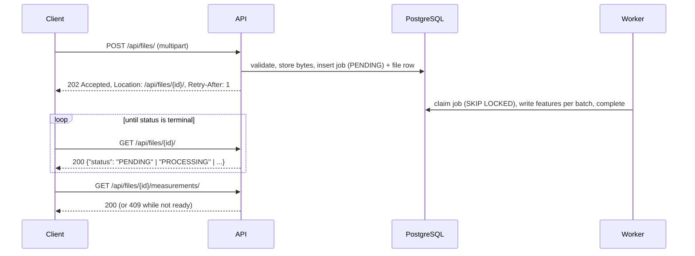

# API overview

Reference for the HTTP API served by `backend/app/main.py` (OpenAPI title "Geospatial Measurement API",
version `1.0.0`). Everything here is derived from the code in `backend/app/api/` and from responses captured
against a running instance. The generated OpenAPI document (`/openapi.json`) is built from the same Pydantic
schemas (`backend/app/api/schemas.py`).

| Page | Covers |
|---|---|
| [upload.md](upload.md) | `POST /api/files/`: multipart fields, `Idempotency-Key`, `Prefer`, validation order, deduplication |
| [files.md](files.md) | File resource, file list, jobs and job lifecycle, capabilities, `/health`, `/ready` |
| [measurements.md](measurements.md) | Measurements, GeoJSON features, vector tiles, per-feature status/error/issue codes |

## Endpoint index

| Method | Path | Purpose | Success |
|---|---|---|---|
| `POST` | `/api/files/` | Upload a `.kml` or zipped Shapefile; queue processing | 200 / 201 / 202 |
| `GET` | `/api/files/` | List uploads, newest first | 200 |
| `GET` | `/api/files/{file_id}/` | File information and processing status | 200 |
| `GET` | `/api/files/{file_id}/measurements/` | Per-feature area / length | 200 |
| `GET` | `/api/files/{file_id}/features/` | Features as a GeoJSON FeatureCollection (paginated) | 200 |
| `GET` | `/api/files/{file_id}/features/{feature_id}/` | One feature, including `repaired_geometry` | 200 |
| `GET` | `/api/files/{file_id}/tiles/{z}/{x}/{y}.mvt` | Mapbox Vector Tile of the file's features | 200 / 204 |
| `GET` | `/api/jobs/{job_id}/` | Processing job status, attempts, progress, error | 200 |
| `GET` | `/api/capabilities` | Accepted formats and limits | 200 |
| `GET` | `/health` | Liveness (no dependencies) | 200 |
| `GET` | `/ready` | Readiness (database + storage) | 200 / 503 |
| `GET` | `/docs`, `/redoc`, `/openapi.json` | Swagger UI, ReDoc, OpenAPI document | 200 |

## Base URL and versioning

| How the API is run | Base URL |
|---|---|
| `uvicorn app.main:create_app --factory` (see `backend/README.md`) | `http://localhost:8000` |
| `docker compose up` | `http://localhost:8080`: nginx proxies `/api/`, `/health`, `/ready`, `/docs`, `/redoc`, `/openapi.json` to the API |

Paths in these documents are relative to the base URL. Links returned by the API (`links.*` in the file
resource, the `Location` header) are root-relative paths such as `/api/files/{id}/`.

**No version prefix.** The assignment fixes the contract at `/api/files/` and `/api/files/{id}/...`, so the
API is served unversioned and those paths are the contract. If the contract changes, the policy would be:

- **Additive changes are not breaking**: new response fields, new endpoints, new optional parameters, new
  values of `code` in errors, issues and warnings. Clients must ignore unknown fields and fall back to the HTTP
  status class for unknown error codes.
- **Breaking changes** (removing or renaming fields, changing types, units, semantics or status codes) would
  be published under a new prefix such as `/api/v2/files/`, served alongside the current paths. The
  current paths would keep their behaviour as the implicit v1 until clients migrate. No `/api/v2` exists today.
- **Changes to measurement results** are versioned separately. `PROCESSOR_VERSION` (`backend/app/__init__.py`,
  currently `2`) is part of the job fingerprint, so after an algorithm change a re-upload of identical content
  is processed again instead of being served from the deduplication cache. Results of existing jobs are not
  recomputed. The processor version does not appear in responses.

## Content types and conventions

- Requests: only `POST /api/files/` takes a body (`multipart/form-data`, see [upload.md](upload.md)).
- Responses: `application/json` for all JSON bodies, including errors and the GeoJSON endpoints (they are not
  served as `application/geo+json`). Tiles are `application/vnd.mapbox-vector-tile`. `204` has no body.
- Units are part of field names: `area_m2` (square metres), `length_m` and `perimeter_m` (metres). Values
  are rounded to 0.01 for presentation ([rounding policy](measurements.md#units-and-rounding)).
- Timestamps are ISO 8601 in UTC, e.g. `2026-10-08T02:14:28.484561Z`.
- Files and jobs are identified by UUIDs. Features are identified by an integer `feature_id`: a 0-based index
  within the file, across all layers.
- GeoJSON geometries follow RFC 7946: WGS 84 longitude/latitude.
- Enumerations are upper-case strings (`COMPLETED`, `MEASURED`, `LOCAL_EQUAL_AREA`). The exception is
  `measurement_strategy` (`local_equal_area` or `utm`), which mirrors the `MEASUREMENT_STRATEGY` setting.

## Trailing slashes

Canonical paths: everything under `/api/files` and `/api/jobs` ends with `/`, for example `/api/files/`,
`/api/files/{id}/measurements/` and `/api/jobs/{id}/`. `/api/capabilities`, `/health`, `/ready` and tile URLs
(`.../{y}.mvt`) have no trailing slash.

FastAPI's `redirect_slashes` (left at its default) handles a path that differs from a route only by the
trailing slash. The response is `307 Temporary Redirect` to the other form, with an absolute `Location`
built from the request. Example: `POST /api/files` returns `307` to `/api/files/`. A 307 requires the client to
repeat the same method and body, so uploads still work when the client follows redirects (`curl -L`,
browsers, the test client). However, the request body can be sent twice. Use the canonical paths.

## Asynchronous processing model



1. `POST /api/files/` validates the upload, stores it, and creates (or reuses) a processing job in the same
   database transaction. It returns `202 Accepted` with `Location` and `Retry-After: 1`. The body is the file
   resource with `status: PENDING`.
2. A worker processes the job. Poll the `Location` (or `GET /api/jobs/{job_id}/` for progress) until
   `status` is terminal: `COMPLETED`, `COMPLETED_WITH_ERRORS` or `FAILED`
   ([lifecycle](files.md#job-lifecycle)).
3. Read results from `measurements/`, `features/` and `tiles/`. Before results exist these return
   `409 RESULTS_NOT_READY` with `Retry-After: 2`. After a failed job they return `409 PROCESSING_FAILED`.

**`Prefer: wait=N` (RFC 7240).** A client that prefers a synchronous answer sends `Prefer: wait=N`. The server
holds the request for up to `min(N, UPLOAD_WAIT_MAX_S)` seconds (30 by default), checking the job every
0.25 s. It answers `201 Created` if the job reached a terminal state, or `202` otherwise. `Preference-Applied:
wait=<seconds>` reports the wait that was applied. Details: [upload.md](upload.md#prefer-wait). Queue,
leases and retries are described in [../architecture/processing.md](../architecture/processing.md).

## Errors

Every error response has the same envelope (captured `GET /api/files/00000000-0000-0000-0000-000000000000/`):

```json
{"error":{"code":"FILE_NOT_FOUND","message":"No file with this id.","details":{"file_id":"00000000-0000-0000-0000-000000000000"},"request_id":"c49da94c54d8484d9adb60d054765c43"}}
```

| Member | Meaning |
|---|---|
| `code` | Stable, machine-readable. Branch on this, not on `message`. |
| `message` | Human-readable explanation. Wording may change. |
| `details` | Object with structured context. Always present; `{}` when there is nothing to add. |
| `request_id` | Same value as the `X-Request-ID` response header. |

Unhandled exceptions become `500 INTERNAL_ERROR` with a generic message. Stack traces and internal messages are
only logged. The 500 is rendered by `RequestContextMiddleware`, which sits inside Starlette's outermost error
middleware, so the response still carries the request id.

### Error codes

| HTTP | `code` | Raised by | `details` |
|---|---|---|---|
| 400 | `INVALID_IDEMPOTENCY_KEY` | `POST /api/files/` | `{}` |
| 400 | `INVALID_CURSOR` | paginated lists: cursor not decodable, or issued for a different `sort` | `{}` |
| 400 | `INVALID_TILE` | tiles: `z` outside 0-22, or `x`/`y` outside `0..2^z-1` | `{}` |
| 400 | `BAD_REQUEST` | FastAPI: request body could not be parsed (e.g. malformed multipart) | `{}` |
| 404 | `FILE_NOT_FOUND` | any `/api/files/{file_id}/...` route | `file_id` |
| 404 | `FEATURE_NOT_FOUND` | `GET /api/files/{id}/features/{feature_id}/` | `{}` |
| 404 | `JOB_NOT_FOUND` | `GET /api/jobs/{job_id}/` | `{}` |
| 404 | `NOT_FOUND` | no such route | `{}` |
| 405 | `METHOD_NOT_ALLOWED` | method not supported on the route | `{}` |
| 409 | `RESULTS_NOT_READY` | measurements, features, tiles while the job is `PENDING`/`PROCESSING`. Sets `Retry-After: 2`. | `status`, `retry_after_s` |
| 409 | `PROCESSING_FAILED` | measurements, features, tiles when the job is `FAILED` | `status`, `error_code`, `error_message` |
| 413 | `FILE_TOO_LARGE` | upload: request body or file over the limit | `max_request_bytes` or `max_upload_bytes` (may be `{}`) |
| 415 | `UNSUPPORTED_FILE_TYPE` | upload: extension not `.kml` / `.zip` | `extension`, `allowed` |
| 422 | `VALIDATION_ERROR` | FastAPI request validation (path, query, form, e.g. missing `file`, bad UUID, `limit=0`, unknown `sort`) | `errors: [{loc, msg, type}]` |
| 422 | `EMPTY_FILE`, `CONTENT_MISMATCH`, `INVALID_KML`, `INVALID_ZIP`, `SHAPEFILE_MISSING`, `SHAPEFILE_INCOMPLETE`, `MULTIPLE_SHAPEFILES`, `ZIP_UNSAFE_PATH`, `ZIP_UNSAFE_ENTRY`, `ZIP_ENCRYPTED`, `ZIP_TOO_MANY_ENTRIES`, `ZIP_TOO_LARGE`, `ZIP_BOMB_SUSPECTED`, `INVALID_CRS`, `IDEMPOTENCY_KEY_REUSED` | upload validation, see [upload.md](upload.md#validation-pipeline) | per code |
| 500 | `INTERNAL_ERROR` | unexpected exception (e.g. storage write failure during upload) | `{}` |

Notes:

- `GET /ready` returns `503` with its own body (`{"status": "not_ready", "checks": {...}}`), not the error envelope.
- The handler maps 401, 403 and 429 to `UNAUTHORIZED`, `FORBIDDEN` and `TOO_MANY_REQUESTS`, but nothing
  raises them: there is no authentication and no rate limiting.
- Failures that occur *during processing* are not HTTP errors. They appear as `job.error.code`
  ([job errors](files.md#job-errors)) or as per-feature `error`/`issues`
  ([feature codes](measurements.md#measurement-status-and-codes)).

## Request IDs

`RequestContextMiddleware` is the outermost middleware. For every HTTP request it:

- accepts an incoming `X-Request-ID` only if it matches `^[A-Za-z0-9._-]{1,64}$`. Any other value (too long,
  spaces, control characters) is silently replaced, not rejected;
- otherwise generates `uuid4().hex` (32 lowercase hex characters);
- echoes the id in the `X-Request-ID` response header on every response, including `413` from the size-limit
  middleware and `500`. It also appears in `error.request_id`;
- binds the id to every log line of the request and writes one access-log line (method, path, status,
  duration).

The upload's request id is stored on the file row. It is also stored on the job when that request created or
requeued the job. The worker binds the job's request id to its log lines, so a client-visible id leads to the
processing logs. Behind the bundled nginx
(`frontend/nginx.conf`), `/api/` requests keep a client-supplied `X-Request-ID`; requests without one get nginx's
own `$request_id`, so the id is present from the edge onwards.

## Pagination

Lists use **keyset pagination** with an opaque `cursor`. Pass `next_cursor` back unchanged until it is `null`.

| Endpoint | Page size | Order | Shape |
|---|---|---|---|
| `GET /api/files/` | `limit` 1-100, default 20 (out of range: 422) | `created_at` desc, `id` desc | `{"items": [...], "next_cursor": ...}` |
| `GET /api/files/{id}/measurements/` | `limit` >= 1, default 100 (`PAGE_SIZE_DEFAULT`), values above 500 (`PAGE_SIZE_MAX`) clamped | `sort` (default `feature_id`) | `{..., "items": [...], "page": {"limit", "next_cursor", "total"}}` |
| `GET /api/files/{id}/features/` | `limit` >= 1, default 100, values above 200 (`FEATURE_PAGE_SIZE_MAX`) clamped | `sort` (default `feature_id`) | `{..., "features": [...], "page": {...}}` |

- `page.limit` is the effective page size after clamping.
- `page.total` is the number of items matching the filters. It is computed only for the **first page** (a
  request without `cursor`) and is `null` on later pages, saving a `COUNT(*)` per page.
- Cursors are base64url-encoded JSON. They are not secret, but clients must not build or edit them. A
  measurement/feature cursor holds the sort token and the last row's `feature_id`. A file-list cursor holds
  `created_at` and `id`.
- A feature cursor is bound to the `sort` it was issued for. Reusing it with another `sort` gives
  `400 INVALID_CURSOR`. Filters are not encoded: send the same filters on every page.
- Results of a finished job are immutable, so cursors stay valid and pages never shift.

**Why the cursor carries only `feature_id`.** For `sort=area_m2` or `length_m`, the natural keyset cursor
would include the last row's sort value. The development database (Supabase) runs with `extra_float_digits=0`,
so PostgreSQL renders `double precision` with 15 significant digits. A float round-tripped through the client
may then no longer equal the stored value, and rows repeat or vanish between pages. This was found when an API
test failed against Supabase. The cursor therefore holds only the last `feature_id` (`{"s": "-area_m2", "i": 7}`),
and the database looks up that row's sort value itself with a primary-key lookup in the keyset predicate
(`backend/app/db/repositories/features.py`).

## CORS

Configured in `create_app` with Starlette's `CORSMiddleware`:

| Setting | Value |
|---|---|
| Allowed origins | `CORS_ALLOW_ORIGINS` (JSON list). Default `["http://localhost:5173"]`; docker-compose sets `["http://localhost:8080"]`. |
| Allowed methods | `GET`, `POST`, `OPTIONS` |
| Allowed request headers | `Content-Type`, `Idempotency-Key`, `Prefer`, `X-Request-ID`, `If-None-Match` |
| Exposed response headers | `Location`, `X-Request-ID`, `Retry-After`, `Idempotent-Replayed`, `Preference-Applied`, `ETag` |
| Credentials | not allowed (default) |
| Preflight cache | `max_age=600` seconds |

Requests from other origins get no `Access-Control-Allow-Origin` header. Responses carry `Vary: Origin`.

## Security headers

Every response — routed responses, handled errors, the upload `413`, CORS preflights and the `500` rendered by the
request-context middleware — carries `X-Content-Type-Options: nosniff`, `X-Frame-Options: DENY`,
`Referrer-Policy: no-referrer` and `Cross-Origin-Opener-Policy: same-origin` (`SecurityHeadersMiddleware` is the
outermost middleware). Upload hardening is described in [upload.md](upload.md) and
[../architecture/security.md](../architecture/security.md).

## Not implemented: authentication, authorization, rate limiting

The API has **no authentication, no authorization and no rate limiting**. Anyone who can reach it can upload,
list every upload (`GET /api/files/`) and read any file's results. `Idempotency-Key` values share one global
namespace. These are production requirements tracked as future work in
[../architecture/security.md](../architecture/security.md). Adding them would be an additive change for
well-behaved clients, except that unauthenticated requests would start receiving `401`/`403`/`429`.

## OpenAPI

| Path | Content |
|---|---|
| `/docs` | Swagger UI |
| `/redoc` | ReDoc |
| `/openapi.json` | OpenAPI document (request/response schemas, error models per route) |

All three are served when `EXPOSE_DOCS=true` (the default) and disabled together when it is `false`.
