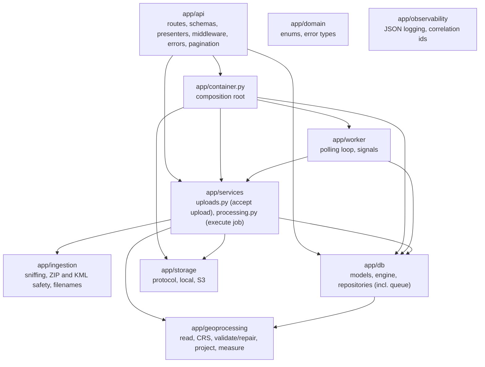

# Backend architecture

One Python package (`backend/app`, distribution `geomeasure` 1.0.0, Python >= 3.12, tested on 3.13) that runs as two
process types from the same code and image: the **API** (FastAPI on uvicorn) and the **worker** (queue consumer). Both
share PostgreSQL/PostGIS and object storage. System context: [overview.md](overview.md).

## Entry points

| Process | Command | Composition |
|---|---|---|
| API | `uvicorn app.main:create_app --factory` | `create_app()` builds the FastAPI app; its lifespan builds a `Container` (or uses one injected by tests). |
| Worker | `python -m app.worker` (console script `geomeasure-worker`) | `app/worker/__main__.py`: settings, logging, engine, storage, `Worker`, SIGTERM/SIGINT handlers. |
| Embedded worker | `EMBEDDED_WORKER=true` on the API | `Container.start_embedded_worker()` runs the same `Worker` in a daemon thread. |
| Migrations | `alembic upgrade head` | `migrations/env.py` reads the same settings. |
| Scripts | `scripts/generate_samples.py`, `scripts/pin_constraints.py`, `scripts/compare_projections.py` | Development tools; not imported by the app. |

## Layers

Every package may also use `app.domain`, `app.config` and `app.observability`; those edges are omitted from the
diagram. The `db -> geo` edge is a single import: repositories accept `FeatureRecord` from
`app.geoprocessing.models`.

### Dependency rules (as observed in the imports)

| Package | Imports from `app.*` | Third-party | Rule |
|---|---|---|---|
| `domain` | nothing | none | Shared vocabulary; depends on nothing. |
| `geoprocessing` | `domain` | numpy, shapely, pyproj, pyogrio (pyarrow via pyogrio) | No FastAPI, SQLAlchemy or storage. Results go to a caller-supplied `sink`. |
| `ingestion` | `domain` | defusedxml | No FastAPI, database or storage. |
| `storage` | `config` (only `build_storage`) | boto3 (lazy import) | No database, no geospatial code. |
| `db` | `config`, `domain`, `geoprocessing.models` | SQLAlchemy, GeoAlchemy2 | The only package that builds SQL. |
| `services` | `config`, `db`, `domain`, `geoprocessing`, `ingestion`, `observability`, `storage` | SQLAlchemy (sessions, error types) | Use cases; no FastAPI imports. |
| `worker` | `config`, `db`, `observability`, `services`, `storage` | SQLAlchemy (error types) | Loop only; the work is in `services.processing`. |
| `api` | `container`, `db`, `domain`, `ingestion` (allowed extensions), `observability`, `services`, `storage` (`StorageError`) | FastAPI, Starlette, pydantic | HTTP concerns. |

Two points a reviewer should know:

- **Writes go through services; reads do not.** `POST /api/files/` calls `UploadService`. The `GET` endpoints call
  repositories directly and map rows to schemas in `api/presenters.py` (rounding, GeoJSON parsing). There is no
  read-service layer because there is no read-side logic beyond querying and presentation.
- **The rules are conventions, not enforced by a tool.** No import-linter contract exists; the table above was
  derived by reading the imports (*future*: add an import-linter check to CI).

## Composition root (`app/container.py`)

`Container` is a dataclass holding the long-lived objects of one process: `settings`, the SQLAlchemy `engine`, the
`session_factory`, the `storage` backend and, optionally, the embedded `worker` and its thread.

- `Container.build(settings)` creates the engine (`app/db/session.py`) and the storage backend (`build_storage`).
- `upload_service()` returns a new `UploadService` per request; with an embedded worker it passes
  `on_enqueued=worker.wake`, so the worker skips its poll wait right after an upload.
- `shutdown()` stops the worker, joins its thread (30 s timeout) and disposes the engine.
- The FastAPI lifespan stores the container on `app.state.container`; `app/api/deps.py` exposes it and a
  per-request `Session` as dependencies (`ContainerDep`, `SessionDep`).
- Tests build a `Container` with a throwaway schema and temp storage and pass it to `create_app(settings, container)`;
  the app then does not tear down what it did not build.

## Request handling

Middleware, outermost first (Starlette adds `ServerErrorMiddleware` outside and `ExceptionMiddleware` inside):

| Middleware | Responsibility |
|---|---|
| `RequestContextMiddleware` | Accept or create `X-Request-ID`, bind it to a contextvar, add it to the response, write the access log line, render unhandled exceptions as the 500 envelope (so even 500s carry the id). |
| `CORSMiddleware` | `CORS_ALLOW_ORIGINS`; methods GET/POST/OPTIONS; exposes `Location`, `X-Request-ID`, `Retry-After`, `Idempotent-Replayed`, `Preference-Applied`. |
| `SecurityHeadersMiddleware` | `X-Content-Type-Options: nosniff`, `X-Frame-Options: DENY`, `Referrer-Policy: no-referrer`, `Cross-Origin-Opener-Policy: same-origin`. |
| `BodySizeLimitMiddleware` | For POST/PUT/PATCH under `/api/files`: reject a declared `Content-Length` above `MAX_UPLOAD_BYTES` + 64 KiB and count the bytes actually received. |

All middleware is pure ASGI (not `BaseHTTPMiddleware`). Endpoints are plain `def` functions, so FastAPI runs them in
its threadpool, which fits the synchronous data layer ([ADR-010](../decisions/adr-010-sync-data-layer.md)); the
multipart body is parsed asynchronously before the endpoint runs.

`Prefer: wait=N` makes the upload endpoint poll the job row every 0.25 s for up to `N` seconds (capped by
`UPLOAD_WAIT_MAX_S`, 30 s). The waiting request occupies a threadpool thread for that time, which bounds how many
concurrent waiting uploads one API process can hold.

### Errors

- `AppError` subclasses (in `app/domain/errors.py`) carry `status_code`, `code`, `message`, `details`; handlers in
  `app/api/errors.py` render them, request-validation errors (`VALIDATION_ERROR`) and HTTP exceptions as
  `{"error": {"code", "message", "details", "request_id"}}`. A `retry_after_s` detail becomes a `Retry-After` header.
- Worker-side `ProcessingError` subclasses decide retry behaviour: `DatasetError` (permanent) and
  `TransientProcessingError`; `LeaseLostError` and `JobInterruptedError` control flow. Details:
  [processing.md](processing.md).

## Configuration (`app/config.py`)

`Settings` (pydantic-settings) reads environment variables (case-insensitive field names), optionally from a `.env`
file in the working directory; unknown variables are ignored, invalid values fail at start-up. `get_settings()` is
cached per process. `backend/.env.example` lists the variables with their defaults.

| Group | Settings (default) |
|---|---|
| Service | `LOG_LEVEL` (INFO), `LOG_FORMAT` (json), `CORS_ALLOW_ORIGINS` (JSON list, `["http://localhost:5173"]`), `EXPOSE_DOCS` (true), `ENVIRONMENT` (development; currently not read by any code) |
| Database | `DATABASE_URL` (`SecretStr`), `DB_SCHEMA` (geomeasure; must match `^[a-z_][a-z0-9_]{0,62}$`), `DB_POOL_SIZE` (5), `DB_MAX_OVERFLOW` (5), `DB_POOL_TIMEOUT_S` (10), `DB_CONNECT_TIMEOUT_S` (10) |
| Storage | `STORAGE_BACKEND` (local / s3), `STORAGE_LOCAL_ROOT` (var/storage), `S3_BUCKET`, `S3_PREFIX`, `S3_ENDPOINT_URL`, `S3_REGION`, `TEMP_DIR` (OS default) |
| Upload limits | `MAX_UPLOAD_BYTES` (100 MiB), `MAX_ZIP_ENTRIES` (200), `MAX_ZIP_UNCOMPRESSED_BYTES` (1 GiB), `MAX_ZIP_COMPRESSION_RATIO` (1000) |
| Processing | `MAX_FEATURES_PER_FILE` (1,000,000), `MAX_VERTICES_PER_FEATURE` (1,000,000), `PROCESSING_BATCH_SIZE` (5,000), `MEASUREMENT_STRATEGY` (local_equal_area / utm), `DISTORTION_WARNING_THRESHOLD` (0.001) |
| Queue / worker | `WORKER_POLL_INTERVAL_S` (1.0), `WORKER_LEASE_S` (300), `JOB_MAX_ATTEMPTS` (3), `JOB_RETRY_BASE_DELAY_S` (10), `EMBEDDED_WORKER` (false; `.env.example` sets true), `UPLOAD_WAIT_MAX_S` (30) |
| Read API | `PAGE_SIZE_DEFAULT` (100), `PAGE_SIZE_MAX` (500), `FEATURE_PAGE_SIZE_MAX` (200), `TILE_MAX_FEATURES` (20,000) |

`PROCESSOR_VERSION` (`app/__init__.py`, currently 2) is a code constant, not a setting: it is part of the job
fingerprint and is bumped when results would change.

## Dependencies

Runtime dependencies are declared in `backend/pyproject.toml` (which links here); versions are those pinned in
`constraints.txt` and used by CI and the image.

| Package | Pinned | Why it is needed |
|---|---|---|
| fastapi | 0.142.2 | HTTP framework: routing, dependency injection, request validation, OpenAPI docs ([ADR-001](../decisions/adr-001-framework.md)). |
| uvicorn[standard] | 0.54.0 | ASGI server; the extras add httptools, uvloop (non-Windows) and watchfiles for `--reload`. |
| python-multipart | 0.0.32 | Required by FastAPI to parse `multipart/form-data` uploads (`UploadFile`, `Form`). |
| pydantic | 2.13.5 | Request/response schemas. |
| pydantic-settings | 2.15.0 | Typed configuration from environment variables / `.env`, `SecretStr`. |
| sqlalchemy | 2.1.3 | Core and ORM: queue statements, keyset predicates, batch inserts, `schema_translate_map`. |
| alembic | 1.20.0 | Schema migrations, also used by the tests to build throwaway schemas. |
| geoalchemy2 | 0.20.0 | PostGIS `Geometry` column type for models and migrations (and the drift comparison). |
| psycopg[binary] | 3.3.4 | PostgreSQL driver (psycopg 3); binary wheel bundles libpq. |
| shapely | 2.2.0 | GEOS geometry operations, vectorised: WKB decoding, validity, `make_valid`, area/length, bounds. |
| pyproj | 3.8.0 | PROJ: CRS parsing and identification, coordinate transformation, `Geod` geodesic reference. |
| pyogrio | 0.13.0 | GDAL vector I/O: layer listing and Arrow-batch streaming of KML and Shapefile ([ADR-009](../decisions/adr-009-streaming-instead-of-geodataframes.md)). |
| pyarrow | 25.0.0 | Arrow record batches returned by `pyogrio.open_arrow(..., use_pyarrow=True)`. |
| numpy | 2.5.3 | Arrays passed to Shapely and pyproj vectorised functions. |
| defusedxml | 0.7.1 | Streaming KML scan that forbids DTDs, entities and external references. |
| boto3 | 1.43.107 | `S3Storage`; imported only when `STORAGE_BACKEND=s3`. |

Development-only (`.[dev]`): pytest, pytest-cov, httpx2 (TestClient transport), hypothesis, moto[s3], geopandas
(test oracle and sample generation only, never imported by `app/`), ruff, mypy.

## Code quality gates

`ruff` (pycodestyle, pyflakes, isort, bugbear, bandit, pyupgrade, simplify, naming, comprehensions, timezone-aware
datetimes, no `print`) and `mypy --strict` over `app/` run in CI; DeprecationWarnings raised from `app.*` fail the
test run (`filterwarnings = error::DeprecationWarning:app.*`).
