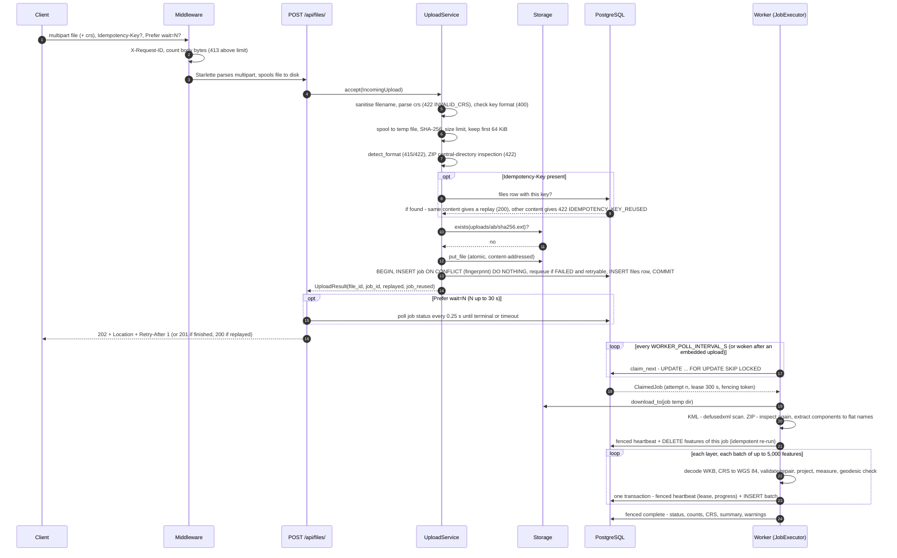
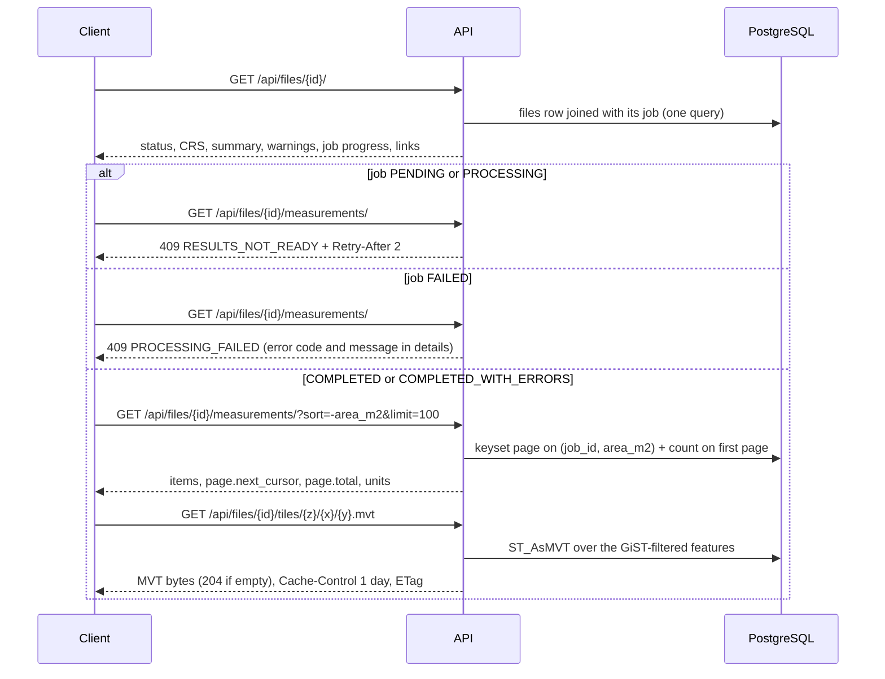

# Data flow: from upload to results

How one upload moves through the system, which component touches it, where the bytes and rows live at each step, and
how results are read back. Queue mechanics are detailed in [processing.md](processing.md); the API contract in the
[API reference](../api/overview.md) ([upload](../api/upload.md), [files](../api/files.md),
[measurements](../api/measurements.md)).

## 1. Upload and processing

### What happens at each stage

| Stage | Component | Data written | Can fail with |
|---|---|---|---|
| Body limit | `BodySizeLimitMiddleware` | nothing | 413 `FILE_TOO_LARGE` (declared or counted bytes above `MAX_UPLOAD_BYTES` + 64 KiB) |
| Multipart parsing | Starlette / python-multipart | Starlette's spooled temp file | 422 `VALIDATION_ERROR` (e.g. no `file` field) |
| Validation | `UploadService` + `app.ingestion` | private temp file (`geomeasure-upload-*`), deleted on exit | 400 `INVALID_IDEMPOTENCY_KEY`; 413; 415 `UNSUPPORTED_FILE_TYPE`; 422 `EMPTY_FILE`, `CONTENT_MISMATCH`, `INVALID_KML`, `INVALID_ZIP`, `SHAPEFILE_*`, `MULTIPLE_SHAPEFILES`, `ZIP_*`, `INVALID_CRS` |
| Storage | `StorageBackend.put_file` | object `uploads/<sha[:2]>/<sha><ext>` (skipped if it exists) | 500 (storage errors are not mapped to a specific code) |
| Enqueue | `JobRepository.get_or_create`, `FileRepository.create` | `processing_jobs` row (new or reused), `files` row, in one transaction | `IDEMPOTENCY_KEY_REUSED`; a concurrent request with the same key replays the winner |
| Processing | `JobExecutor`, `process_dataset` | `features` rows per batch; progress and lease on the job row | per-feature errors become feature statuses; dataset errors fail the job |
| Completion | `JobRepository.complete` | status, counts, CRS, `summary`, `warnings` | lease lost (another worker owns the job) |

Nothing is persisted when validation fails: the temp file is removed, no object is stored, no row is written. The
object is stored before the database transaction, so a failing transaction leaves an unreferenced object
([storage.md](storage.md)).

### Deduplication and idempotency outcomes

The job `fingerprint` is SHA-256 over the content hash, format, CRS override, measurement strategy and
`PROCESSOR_VERSION`. Every request creates a new `files` row except an idempotent replay.

| Case | Job | Response |
|---|---|---|
| New content/options | New `PENDING` job | 202 (201 if `Prefer: wait` saw it finish) |
| Same content and options as an earlier upload | Existing job reused, not reprocessed | 201 with the existing result if finished, else 202 |
| Earlier job `FAILED` with a retryable error | Same job requeued (attempts reset) | 202 |
| Earlier job `FAILED` permanently (bad input) | Reused as is | 201 with status `FAILED` |
| Same `Idempotency-Key` and same content | Nothing created | 200, `Idempotent-Replayed: true`, original file |
| Same `Idempotency-Key`, different content | Nothing created | 422 `IDEMPOTENCY_KEY_REUSED` |

### Inside one batch

`FeatureProcessor.process` (pure computation, no I/O) turns a batch of WKB + attributes into `FeatureRecord`s:
sanitise properties and derive a name, decode WKB (vectorised), reject missing/malformed/empty/too-complex
geometries, transform to WGS 84 with `always_xy` and check lon/lat ranges, normalise homogeneous collections, validate
and repair, choose a projection per feature (local equal-area by default, or UTM), transform per projection group,
measure area/perimeter or length, compute the geodesic reference and flag differences above 0.1 %. Without a CRS,
coordinates are kept raw and measurable features fail with `CRS_MISSING`. Details:
[../geospatial/measurements.md](../geospatial/measurements.md), [../geospatial/crs.md](../geospatial/crs.md),
[../geospatial/geometry-handling.md](../geospatial/geometry-handling.md).

The job status is `COMPLETED` when no feature has `FAILED`, `COMPLETED_WITH_ERRORS` when at least one has, and
`FAILED` only for dataset-level errors (unreadable file, too many features, unsafe content) or exhausted attempts.

## 2. Reading results

| Endpoint | Source | Notes |
|---|---|---|
| `GET /api/files/` | `files` + job, keyset on `(created_at, id)` | Newest first, `limit` up to 100. |
| `GET /api/files/{id}/` | `files` + job row | `summary` was stored at completion, so this is O(1) regardless of feature count; `feature_count` is null until results exist. |
| `GET /api/jobs/{id}/` | job row | Attempts, progress, timings, error. |
| `GET /api/files/{id}/measurements/` | `features` | Filters `status`, `geometry_type`, `layer`; sort `feature_id`, `area_m2`, `length_m` (prefix `-` for descending, NULLs last); default 100, max 500 per page; values rounded to 0.01. |
| `GET /api/files/{id}/features/` | `features`, GeoJSON built by `ST_AsGeoJSON` | RFC 7946 FeatureCollection, max 200 per page; features with unknown CRS have `geometry: null` and a `raw_geometry`. |
| `GET /api/files/{id}/features/{n}/` | one `features` row | Adds `repaired_geometry` when repair happened. |
| `GET /api/files/{id}/tiles/{z}/{x}/{y}.mvt` | `features.geom` | z 0-22; at most `TILE_MAX_FEATURES` per tile, largest first. |

Cursors are opaque base64url JSON holding the sort token and the last `feature_index`; a cursor used with a different
sort order is rejected with 400 `INVALID_CURSOR`. Because the database resolves the sort value of that row, paging is
stable even where float text rendering is lossy ([database.md](database.md#precision-note-supabase)).
