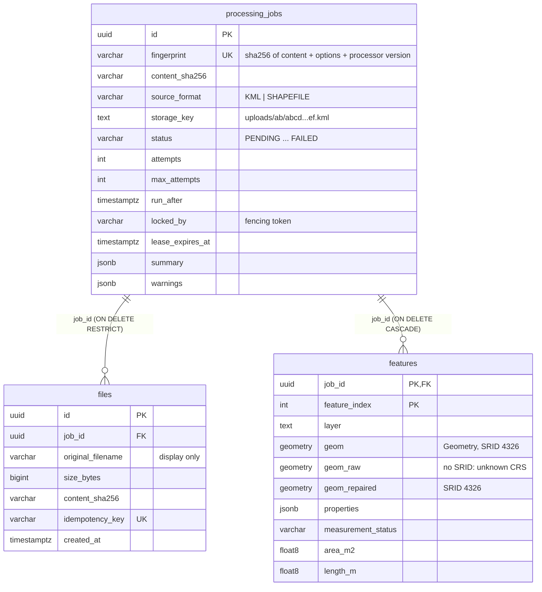

# Database

PostgreSQL with PostGIS holds the upload records, the job queue and every extracted feature with its measurements.
Code: [`backend/app/db/`](../../backend/app/db/README.md); migrations: `backend/migrations/`. Decision record:
[ADR-004](../decisions/adr-004-database.md).

| Environment | Database |
|---|---|
| Development / demo | Supabase, PostgreSQL 17.11 + PostGIS 3.3.7 (PostGIS in the `extensions` schema), Session pooler |
| CI | `postgis/postgis:17-3.5` service container |
| Docker Compose | `postgis/postgis:17-3.5` (`db` service) |
| Minimum (per `.env.example`) | PostgreSQL 14+, PostGIS 3+ (`ST_TileEnvelope` needs PostGIS 3) |

## Schema

All tables live in one schema, `DB_SCHEMA` (default `geomeasure`), selected at runtime with SQLAlchemy's
`schema_translate_map`. Supabase's auto-generated REST API serves the `public` schema, so these tables are not
reachable through it.



### `processing_jobs`: queue entry and result header

One row per **unique** combination of content hash, format, CRS override, measurement strategy and
`PROCESSOR_VERSION` (the `fingerprint`). Identical uploads share a row and are processed once.

| Column group | Columns |
|---|---|
| Identity / input | `id`, `fingerprint` (unique), `content_sha256` (indexed), `source_format`, `storage_key`, `crs_override`, `processor_version`, `measurement_strategy` |
| Queue state | `status`, `attempts`, `max_attempts`, `run_after`, `locked_by`, `lease_expires_at`, `request_id` (of the request that created or requeued it) |
| Progress / outcome | `started_at`, `finished_at`, `duration_ms`, `total_features`, `processed_features`, `measured_features`, `not_applicable_features`, `unsupported_features`, `failed_features` |
| Result header | `crs`, `crs_name`, `crs_source`, `crs_wkt` (only for CRSs without an authority code), `summary` (JSONB: totals, bbox, geometry types, layer list, counts), `warnings` (JSONB list of `{code, message}`) |
| Error | `error_code`, `error_message` (truncated to 2,000 chars), `error_retryable` |
| Audit | `created_at`, `updated_at` |

The summary is accumulated while batches stream through and stored once, so `GET /api/files/{id}/` never aggregates
over `features`.

### `files`: one row per upload request

What the API calls a "file": `id`, `job_id`, `original_filename` (sanitised, display only), `content_type` (as sent by
the client, untrusted), `size_bytes` (CHECK `> 0`), `content_sha256`, `idempotency_key` (unique, nullable),
`request_id`, `created_at`. Many files can point at one job.

### `features`: one row per extracted feature

Primary key `(job_id, feature_index)`; `feature_index` is the 0-based position across all layers of the dataset and is
the `feature_id` exposed by the API.

| Column group | Columns |
|---|---|
| Source | `layer`, `source_fid`, `name` (derived from common label attributes), `geometry_type`, `has_z`, `vertex_count`, `properties` (JSONB, sanitised) |
| Geometry | `geom` (`geometry(Geometry, 4326)`, the original in WGS 84), `geom_raw` (`geometry` without SRID, only when the CRS is unknown or coordinates could not be placed in WGS 84), `geom_repaired` (SRID 4326, only when repair was needed; this is what was measured) |
| Validity | `is_valid`, `validity_reason` (GEOS reason) |
| Measurement | `measurement_status`, `area_m2`, `perimeter_m`, `length_m`, `projected_crs`, `projection_method`, `geodesic_area_m2`, `geodesic_length_m` (all `double precision`; the API rounds to 0.01) |
| Diagnostics | `error_code`, `error_message`, `issues` (JSONB list) |

Geometries are stored 2D (`shapely.to_wkb(..., output_dimension=2)`); Z presence is kept in `has_z`.

## Constraints

| Constraint | Purpose |
|---|---|
| `ck_processing_jobs_status_valid`, `ck_processing_jobs_source_format_valid`, `ck_features_measurement_status_valid` | Enumerations enforced in the database; generated from the Python enums. |
| `ck_processing_jobs_attempts_valid` | `attempts >= 0 AND max_attempts >= 1`. |
| `ck_files_size_positive` | No empty uploads. |
| `ck_features_one_geometry_representation` | `geom IS NULL OR geom_raw IS NULL`: coordinates are never labelled 4326 and "unknown" at the same time. |
| `ck_features_area_non_negative`, `ck_features_length_non_negative` | Sanity of measurements. |
| `fk_files_job_id_processing_jobs` (`RESTRICT`) | A job cannot disappear under an upload record. |
| `fk_features_job_id_processing_jobs` (`CASCADE`) | Deleting a job removes its features. |

## Indexes and the queries they serve

| Index | Definition | Serves |
|---|---|---|
| `uq_processing_jobs_fingerprint` | unique `(fingerprint)` | `INSERT ... ON CONFLICT (fingerprint) DO NOTHING` (dedup) |
| `ix_processing_jobs_content_sha256` | `(content_sha256)` | Lookups by content hash |
| `ix_processing_jobs_claimable` | `(run_after) WHERE status = 'PENDING'` | Claim query: due pending jobs in `run_after` order |
| `ix_processing_jobs_leases` | `(lease_expires_at) WHERE status = 'PROCESSING'` | Claim query: jobs with expired leases |
| `uq_files_idempotency_key` | unique `(idempotency_key)` | Idempotent replay lookup; race detection |
| `ix_files_job_id` | `(job_id)` | Join from job to its uploads |
| `ix_files_created_at_id` | `(created_at, id)` | `GET /api/files/` newest-first keyset pagination |
| `pk_features` | `(job_id, feature_index)` | Default order, `feature_id` keyset, single-feature lookup, `DELETE` of a job's rows |
| `ix_features_job_id_area_m2`, `ix_features_job_id_length_m` | `(job_id, area_m2)`, `(job_id, length_m)` | `sort=area_m2` / `length_m` (either direction) |
| `ix_features_geom` | GiST `(geom)` | Tile query bounding-box filter (`geom && envelope`) |

Filters on `measurement_status`, `geometry_type` and `layer` have no dedicated index; they are applied to the rows of
one job, located through the primary key.

## Queue query

The claim is a single statement (`JobRepository.claim_next`):

```sql
UPDATE processing_jobs SET status = 'PROCESSING', attempts = attempts + 1, locked_by = :token,
       lease_expires_at = now() + :lease, started_at = now(), ...
WHERE id = (
  SELECT id FROM processing_jobs
  WHERE (status = 'PENDING' AND run_after <= now())
     OR (status = 'PROCESSING' AND lease_expires_at < now())
  ORDER BY run_after LIMIT 1
  FOR UPDATE SKIP LOCKED)
RETURNING id, storage_key, source_format, crs_override, attempts, max_attempts, request_id;
```

`SKIP LOCKED` lets any number of workers claim concurrently without blocking or double-claiming. Workers poll
(every `WORKER_POLL_INTERVAL_S`); `LISTEN/NOTIFY` is deliberately not used because transaction poolers do not
support it. Details: [processing.md](processing.md).

## PostGIS usage

| Function | Where | Purpose |
|---|---|---|
| `ST_GeomFromWKB(wkb, srid)` | batch insert | Store Shapely-produced WKB with an explicit SRID (4326, or 0 for `geom_raw`) |
| `ST_AsGeoJSON(geom, 9)` | features endpoints | GeoJSON built in the database, 9 decimal places |
| `ST_TileEnvelope`, `ST_ClipByBox2D`, `ST_MakeEnvelope`, `ST_Transform(..., 3857)`, `ST_AsMVTGeom(..., 4096, 64, true)`, `ST_AsMVT` | tile endpoint | Mapbox Vector Tiles. Geometries are clipped to ±85.05112878° before the Mercator transform; at most `TILE_MAX_FEATURES` (20,000) per tile, largest area/length first. |

The repaired geometry is not used for tiles; the map draws the geometry as submitted.

## Migrations

- Alembic, one revision so far (`0001_initial_schema`). The target schema is configurable; `env.py` creates it if
  missing and keeps `alembic_version` inside it, so independent schemas (production, per-test) never share migration
  state.
- `0001` enables PostGIS when absent: `CREATE EXTENSION postgis WITH SCHEMA extensions` if an `extensions` schema
  exists (Supabase), otherwise `CREATE EXTENSION postgis`. The role needs the privilege to create extensions.
- `downgrade()` drops the three tables; it leaves the schema and the extension in place.
- A test compares the migrated schema with the ORM models (`compare_metadata`) and fails on any drift
  ([../testing/strategy.md](../testing/strategy.md#migration-drift-test)).
- Production practice (expand/contract, one-off migration task): [../deployment/production.md](../deployment/production.md#migrations-as-a-one-off-task).

## Connections and poolers

- psycopg 3 with `prepare_threshold=None`: no server-side prepared statements, which PgBouncer/Supavisor in
  transaction mode cannot route.
- No session state: no `SET`, no `search_path`, no `LISTEN`, no advisory locks. The schema is applied per statement.
- Pool per process: `DB_POOL_SIZE` 5 + `DB_MAX_OVERFLOW` 5, `pool_pre_ping`, `pool_recycle` 30 min.
- Supabase's direct host is IPv6-only; development used the Session pooler over IPv4.

## Precision note (Supabase)

Supabase runs with `extra_float_digits = 0`, so `double precision` values are rendered as text with 15 significant
digits. Values the application reads back are used for display (rounded to 0.01) and are unaffected, but a float
round-tripped through a client is not guaranteed to equal the stored value. For that reason pagination cursors carry
only `feature_index` and the database looks up the sort value itself.

## Growth and retention

Nothing is deleted by the application: there are no delete endpoints and no retention job. `features` grows by one row
per feature of every unique upload (duplicates share a job). Re-uploading after a `PROCESSOR_VERSION` change creates a
new job and new feature rows; the old ones remain. Partitioning, retention and archiving are *future work*
([scalability.md](scalability.md), [../deployment/production.md](../deployment/production.md#backup-and-retention)).

## Operational queries

```sql
-- Queue depth (due, unclaimed); uses ix_processing_jobs_claimable
SELECT count(*) FROM geomeasure.processing_jobs WHERE status = 'PENDING' AND run_after <= now();

-- Jobs whose worker died (lease expired, not yet reclaimed)
SELECT id, locked_by, lease_expires_at FROM geomeasure.processing_jobs
WHERE status = 'PROCESSING' AND lease_expires_at < now();

-- Failures in the last day by code
SELECT error_code, error_retryable, count(*) FROM geomeasure.processing_jobs
WHERE status = 'FAILED' AND finished_at > now() - interval '1 day' GROUP BY 1, 2;
```
