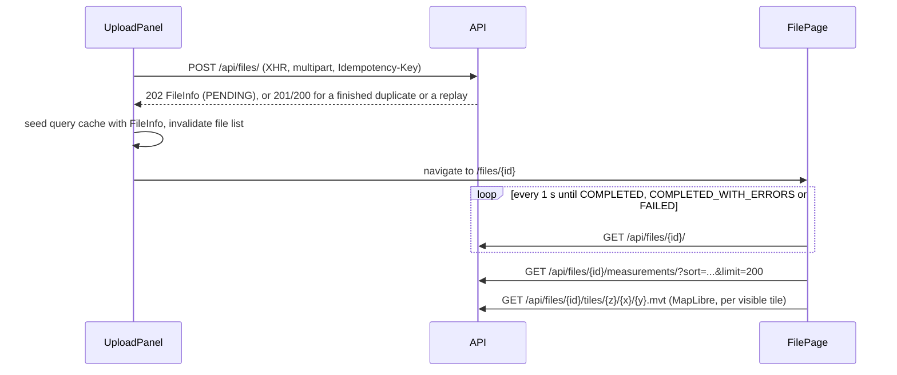

# Frontend architecture

A static single-page application (Vite build) that talks only to the public HTTP API. Commands, environment variables
and the module-level notes are in [`frontend/README.md`](../../frontend/README.md); the choice of Vite + MapLibre on
PostGIS vector tiles is recorded in [ADR-007](../decisions/adr-007-frontend-and-map.md).

## Structure

```
src/
  main.tsx                 providers: ThemeProvider > QueryClientProvider > TooltipProvider > BrowserRouter; Toaster
  App.tsx                  routes; FilePage lazy-loaded
  pages/                   home-page.tsx, file-page.tsx
  components/
    upload/upload-panel    file selection, CRS override, XHR progress
    files/recent-files     newest-first list with "load more"
    file/title-block       survey-style summary grid
    file/job-state         queued/processing progress, failure panel, file warnings
    file/feature-table     filters, sort, virtualised rows
    file/feature-details   selected feature: measurement, geodesic check, issues, attributes
    map/feature-map        MapLibre map on vector tiles
    layout/app-shell       header, navigation, theme switch
    status.tsx             status mark + label
    ui/                    shadcn/ui components (Radix), restyled
  hooks/                   queries.ts (TanStack Query), use-theme.tsx
  lib/                     api.ts (HTTP client), types.ts (API types), format.ts, upload-validation.ts
```

`lib/types.ts` mirrors the backend schemas by hand (`backend/app/api/schemas.py`); there is no generated client, so
contract changes must be applied to both sides.

## State ownership

| State | Owner |
|---|---|
| Server data (capabilities, files, file status, measurement pages, single features) | TanStack Query cache, keyed by resource and query |
| Filters and sort order | `FilePage` component state, passed to the table (query key) and the map (layer filters) |
| Selected feature (and whether it came from the table) | `FilePage` component state |
| Upload form (file, CRS, progress, error) | `UploadPanel` component state |
| Theme preference | `ThemeProvider` context, persisted in `localStorage` |

There is no global client store. The default query client does not refetch on window focus and does not retry 4xx
responses (they are answers, not glitches); other failures are retried up to two times.

## Flows

### Upload and follow processing



While a job runs, the processing panel shows `processed_features` (the total is unknown until completion) and the
attempt number when it is above 1.

### Table paging

`useInfiniteQuery` fetches pages of 200 with the API's opaque `next_cursor`. Sorting (`feature_id`, `±area_m2`,
`±length_m`) and filtering (status, geometry type) happen in the database; changing either changes the query key and
starts a fresh cursor chain. The virtualiser renders only visible rows and requests the next page when the last
rendered row is within 20 of the end. The header shows the filtered total from the first page against the file's total.

### Map

- One vector source over `/api/files/{id}/tiles/{z}/{x}/{y}.mvt` (source layer `features`, `maxzoom` 16), with four
  layers: polygon fill, polygon outline, lines, points. Tile properties: `feature_id` (also the MVT feature id),
  `name`, `geometry_type`, `status`, `area_m2`, `length_m`.
- Styling: polygons in the accent colour, lines and points in the foreground colour, `FAILED`/`UNSUPPORTED` in the
  muted colour; colours are read from CSS variables, so the overlay follows the theme.
- Filters chosen in the table are applied with `map.setFilter` on the already-loaded tiles.
- Clicking a feature selects it (feature state `selected`); selecting a table row loads that feature's GeoJSON and
  fits the map to its bounds. The initial view fits the file's `summary.bbox`.
- Switching theme swaps the basemap style; the overlay is re-added on `style.load`.
- Tiles are served with `Cache-Control: public, max-age=86400` and an `ETag`, so the browser reuses them.

## Performance

| Concern | Approach |
|---|---|
| Initial load | Home page bundle 452 kB (146 kB gzip); the file page with MapLibre is a separate lazy chunk. |
| Large files | No full GeoJSON download: the map uses tiles, the table uses keyset pages and virtualisation. |
| Polling | Only while a job is unfinished; finished results are cached indefinitely (`staleTime: Infinity`). |
| Map worker | `maplibre-gl-worker.mjs` served verbatim by a Vite plugin and registered with `setWorkerUrl()`. |

## Accessibility

- Status uses text plus a mark shape, never colour alone.
- Skip link to the main content; `aria-live` regions for upload progress, processing state and the table count.
- The table uses ARIA table roles; rows are focusable and selectable with Enter or Space.
- Visible focus ring (2 px outline in the accent colour).
- The map region is labelled, and the same features are reachable through the table.

These were checked by reading the code and manual use; no automated accessibility audit runs in CI.

## Deployment shapes

| Shape | API location | Configuration |
|---|---|---|
| Vite dev server | Proxied to `VITE_DEV_API_TARGET` | none |
| Docker image (nginx) | Same origin, nginx proxies `/api/` | `VITE_API_BASE_URL` empty |
| Static hosting (S3 + CloudFront, design only) | Separate origin, or same origin via a CloudFront behaviour | `VITE_API_BASE_URL` at build time; backend `CORS_ALLOW_ORIGINS` |

See [../deployment/docker.md](../deployment/docker.md) and [../deployment/production.md](../deployment/production.md).

## Known limitations

- No automated tests for the map, table, upload panel or hooks; no browser end-to-end suite.
- No authentication or user concept (none exists in the API).
- Hand-maintained API types.
- Upload cannot be cancelled from the UI (the client function accepts an `AbortSignal`, the panel does not pass one).
- Basemap depends on OpenFreeMap unless overridden.
