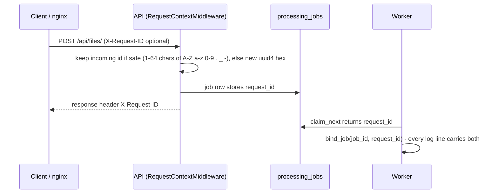

# Observability

What the system emits today: structured logs with correlation ids, health/readiness endpoints, and job state that is
queryable through the API and SQL. **Not implemented**: metrics, tracing, dashboards, alerting and error-tracking
integrations. Code: `backend/app/observability/`, `backend/app/api/middleware.py`, `backend/app/api/routes/system.py`.

## Logs

Standard-library `logging` with one handler on stdout, configured by `configure_logging(LOG_LEVEL, LOG_FORMAT)` in
both the API factory and the worker entry point.

| `LOG_FORMAT` | Output | Default |
|---|---|---|
| `json` | One JSON object per line (for CloudWatch, Loki, Datadog without parsing rules) | Code default and Docker image |
| `console` | `HH:MM:SS LEVEL logger: message \| request_id=... job_id=... \| key=value ...` | Set in `.env.example` for local work |

JSON fields:

| Field | Present | Source |
|---|---|---|
| `ts` | always | UTC ISO 8601 with milliseconds |
| `level`, `logger`, `msg` | always | log record |
| `request_id`, `job_id`, `worker_id` | when set | `contextvars` (see below) |
| structured fields | per event | `logger.info("msg", extra={"fields": {...}})`, merged into the top level |
| `exc_type`, `exc` | on exceptions | exception class name and formatted traceback |

Illustrative line (format as produced by `JsonFormatter`; values invented):

```json
{"ts": "2026-10-08T07:40:12.345+00:00", "level": "INFO", "logger": "app.access", "msg": "request", "request_id": "4f1c0e9a2b7d4c55a1e3f0b6c2d9e871", "method": "POST", "path": "/api/files/", "status": 202, "duration_ms": 84.2}
```

Noise control: uvicorn's own access log is disabled (the middleware writes a richer one), the handlers of the
`uvicorn` and `uvicorn.error` loggers are removed, and `botocore`, `boto3`, `urllib3`, `s3transfer` are raised to
`WARNING`. SQLAlchemy and botocore records reach the root handler and get the same format.

**Known gap (uvicorn's own lines).** When the API is started with the `uvicorn` CLI, uvicorn first applies its
default logging config, which sets `propagate=False` on the `uvicorn` logger; `configure_logging` removes that
logger's handlers but does not reset `propagate`. Applying uvicorn's default config followed by
`configure_logging` shows the effect: uvicorn's INFO lines (startup, shutdown) are dropped and its WARNING/ERROR lines
fall through to Python's last-resort handler as plain text on stderr, not JSON. Application logs are unaffected.

**Redaction.** Structured fields whose key (case-insensitive) is `password`, `secret`, `token`, `authorization`,
`database_url` or `api_key` are replaced with `***`. Redaction is by exact top-level key, not by value; the primary
protection is that the database URL is a `SecretStr` and is never passed to a logger.

### Events

| Logger | Message | Level | Fields |
|---|---|---|---|
| `app.access` | `request` | INFO | `method`, `path` (no query string), `status`, `duration_ms`; one line per HTTP request, including 413s and 500s |
| `app.api` | `unhandled error` | ERROR | traceback; the client gets a generic 500 with the same `request_id` |
| `app.api` | `application error` | ERROR | `code` (only for `AppError`s with status >= 500) |
| `app.api` | `readiness: database unavailable` | WARNING | `error` (exception type name only) |
| `app.processing` | `job started` | INFO | `attempt`, `max_attempts`, `format` |
| `app.processing` | `job finished` | INFO | `status`, `duration_ms`, `features`, `measured`, `not_applicable`, `unsupported`, `failed` |
| `app.processing` | `job failed` | WARNING if it will be retried, ERROR if final | `error_code`, `error` (first 500 chars), `retryable`, `next_status`, `retry_in_s` |
| `app.processing` | `lease lost; another worker owns the job now` / `job released for shutdown` / `unexpected processing error` / `could not record job failure` | WARNING / INFO / ERROR / ERROR | traceback where applicable |
| `app.worker` | `worker started` / `worker stopped` | INFO | `poll_interval_s`, `lease_s` |
| `app.worker` | `queue unavailable; backing off` | ERROR | `backoff_s` (1 s doubling to 30 s), traceback |
| `app` | `embedded worker started` | INFO | |

## Correlation ids



- `request_id_var`, `job_id_var`, `worker_id_var` are `contextvars`. They follow asyncio tasks and are copied into
  the threadpool that runs FastAPI's sync endpoints, so no logger has to be passed around.
- The API echoes `X-Request-ID` on **every** response, including 413s from the body-size middleware and unhandled
  500s, and puts it in the error envelope's `request_id`. CORS exposes the header to browsers; the frontend keeps it
  on `ApiError.requestId`.
- The request id is stored on the job row (`processing_jobs.request_id`) and re-bound by the worker, so one id links
  the upload request with the processing logs. A requeue on re-upload stores the new request id.
- Workers set `worker_id` to `<hostname>-<pid>` (or `embedded` for the in-process thread); the fencing token in
  `locked_by` is that name plus a random suffix per attempt.
- In Docker Compose, nginx sets `X-Request-ID: $request_id` on proxied API requests, so the id originates at the edge.

## Health endpoints

| Endpoint | Checks | Response |
|---|---|---|
| `GET /health` | none (process is up) | `200 {"status": "ok"}` |
| `GET /ready` | `SELECT 1` through the engine; `storage.check()` (local: root writable; S3: `HeadBucket`) | `200 {"status": "ready", "checks": {"database": "ok", "storage": "ok"}}` or `503` with `"not_ready"` and the failing check marked `unavailable` |

`/health` deliberately has no dependencies, so a database outage cannot make an orchestrator restart healthy
processes. Use in AWS: [../deployment/production.md#health-checks](../deployment/production.md#health-checks).

## Job state as an operational signal

- `GET /api/jobs/{id}/` and the `job` object inside `GET /api/files/{id}/` expose `status`, `attempts`,
  `max_attempts`, `progress.processed_features`, `started_at`, `finished_at`, `duration_ms` and `error {code,
  message, retryable}`.
- `processed_features` is updated with every batch heartbeat. `total_features` is only written when the job
  completes, so during processing the progress total is `null` (the UI then shows "N features so far").
- Queue depth, stuck leases and failure counts are plain SQL over `processing_jobs`; queries are listed in
  [database.md](database.md#operational-queries).

## Not implemented / future

| Capability | Note |
|---|---|
| Metrics | No Prometheus endpoint, StatsD or CloudWatch EMF. Candidates: queue depth, job duration and features/s, failures by `error_code`, request latency by route. Queue depth is the planned autoscaling signal ([../deployment/production.md](../deployment/production.md#scaling-on-queue-depth-not-implemented--future)). |
| Tracing | No OpenTelemetry instrumentation. (`opentelemetry-api` appears in `constraints.txt` only as a transitive dependency; the code does not use it.) |
| Alerting, dashboards, log retention | Not configured anywhere in the repository. |
| Error tracking (Sentry or similar) | Not integrated; exceptions appear only in logs. |
| Frontend telemetry | None. Errors are shown to the user (toasts, inline alerts) and not reported anywhere. |
