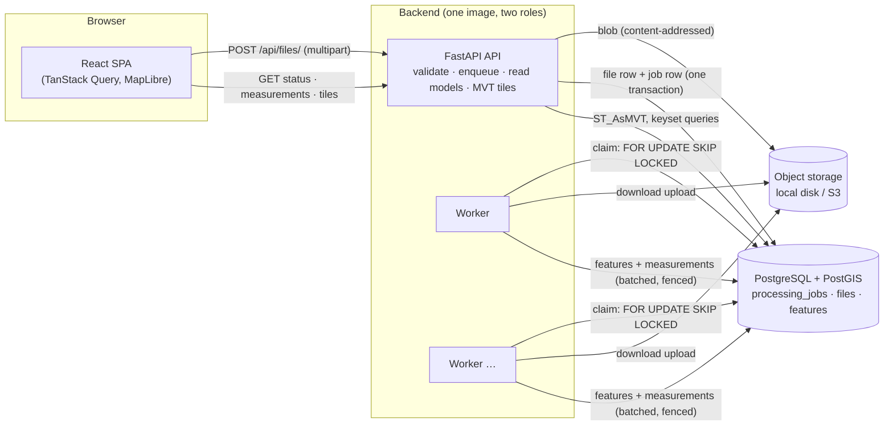

# Architecture overview

A **modular monolith**: one backend codebase deployed as two process types (API and worker) that share a database
and object storage, plus a static frontend. Service boundaries are enforced by package structure, not by the
network.

## Why a modular monolith (and not microservices)

The domain has one bounded context (ingest → measure → serve). Splitting "upload service", "processing service" and
"results service" would add network hops, deployment units, distributed transactions and versioned contracts, while
the only component with different scaling needs — CPU-heavy processing — already scales independently as a separate
**process type** (worker) of the same image. The boundaries that matter are explicit in code:

| Package | Responsibility | May depend on |
|---|---|---|
| `app/api` | HTTP: routes, schemas, middleware, error envelope | services, db.repositories, domain |
| `app/services` | use cases: accept upload, execute job | ingestion, geoprocessing, db, storage, domain |
| `app/geoprocessing` | framework-free geospatial core | domain only (+ GDAL/GEOS/PROJ libraries) |
| `app/ingestion` | untrusted-input defences | domain only |
| `app/db` | models, engine, repositories, the job queue | domain, geoprocessing models |
| `app/storage` | object storage protocol + implementations | — |
| `app/worker` | queue consumer process | services, db |
| `app/observability` | logging, correlation ids | — |

The geospatial core and the ingestion defences import nothing from FastAPI, SQLAlchemy or storage; they are tested
without a server or database. Routes contain no business logic.

## Request lifecycle in one paragraph

`POST /api/files/` streams the body to a temp file while hashing it and enforcing the size limit, rejects bad input
(extension, magic bytes, ZIP structure, CRS syntax) with 4xx, stores the bytes under their SHA-256, and in one
transaction inserts the file row and gets-or-creates the job (deduplicated by fingerprint). It returns `202` with a
`Location`. A worker claims the job, re-validates the file, streams every layer in batches through the geospatial
pipeline, writes features with a fenced heartbeat per batch, and finally stores the summary and status. The client
polls `GET /api/files/{id}/` and then reads measurements (keyset-paginated) and vector tiles. Details:
[data-flow.md](data-flow.md), [processing.md](processing.md).

## Where to read next

| Topic | Document |
|---|---|
| Backend layering, config, dependencies | [backend.md](backend.md) |
| Upload → result sequence | [data-flow.md](data-flow.md) |
| Job queue, retries, failure isolation | [processing.md](processing.md) |
| Schema, indexes, PostGIS | [database.md](database.md) |
| Storage abstraction | [storage.md](storage.md) |
| Scaling to 1M+ features and many files | [scalability.md](scalability.md) |
| Threat model and defences | [security.md](security.md) |
| Logs, correlation ids, health | [observability.md](observability.md) |
| Frontend | [frontend.md](frontend.md) |
| CRS and measurement | [../geospatial/crs.md](../geospatial/crs.md), [../geospatial/measurements.md](../geospatial/measurements.md) |
| Decisions and alternatives | [../decisions/](../decisions/README.md) |
