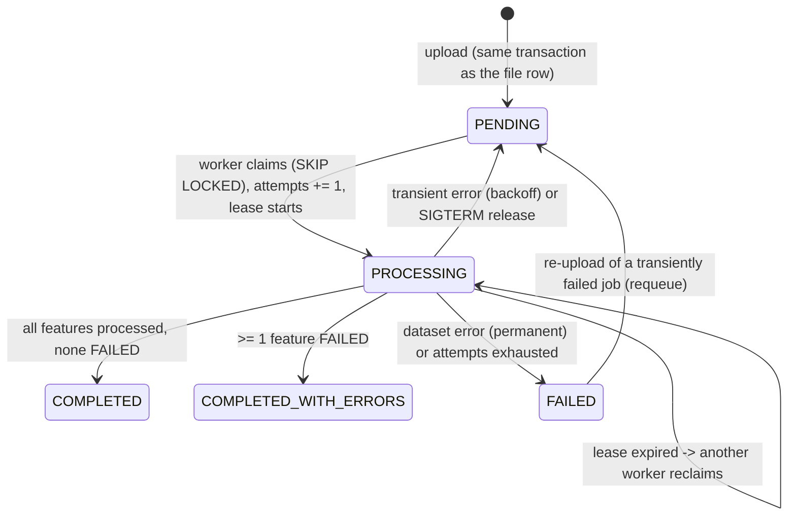

# Processing: job queue, workers, retries, failure isolation

> Code: [`app/db/repositories/jobs.py`](../../backend/app/db/repositories/jobs.py) (queue),
> [`app/services/processing.py`](../../backend/app/services/processing.py) (job execution),
> [`app/worker/runner.py`](../../backend/app/worker/runner.py) (loop),
> [`app/geoprocessing/pipeline.py`](../../backend/app/geoprocessing/pipeline.py) (dataset pipeline) ·
> Decision: [ADR-002](../decisions/adr-002-processing-model.md)

## Why it exists
Processing is CPU-bound and its cost grows with features × vertices. Running it in the request would tie up API
workers, hit proxy timeouts and lose work on a crash. The queue decouples accepting a file from processing it, gives
retries and crash recovery, and lets throughput scale by adding worker processes.

## Job lifecycle



## Claiming

```sql
UPDATE processing_jobs
SET status = 'PROCESSING', attempts = attempts + 1, locked_by = :token,
    lease_expires_at = now() + :lease, started_at = now(), processed_features = 0
WHERE id = (
    SELECT id FROM processing_jobs
    WHERE (status = 'PENDING' AND run_after <= now())
       OR (status = 'PROCESSING' AND lease_expires_at < now())      -- crashed / hung worker
    ORDER BY run_after
    LIMIT 1
    FOR UPDATE SKIP LOCKED                                           -- never blocks, never double-claims
)
RETURNING id, storage_key, source_format, crs_override, attempts, max_attempts, request_id;
```

(Generated with SQLAlchemy Core so the configurable schema applies.) Partial indexes on `run_after WHERE status =
'PENDING'` and `lease_expires_at WHERE status = 'PROCESSING'` keep this fast however many finished jobs accumulate.

`:token` is `<worker name>:<random>` — unique per **attempt**. It is the fencing token.

## Executing a job (`JobExecutor.execute`)

1. Download the upload to a private `TemporaryDirectory` (cleaned up on every exit path).
2. **Re-validate** the untrusted file (KML XML-safety scan; ZIP inspection) and extract Shapefile components.
3. In one transaction: fenced heartbeat + `DELETE` of any features left by a previous attempt (idempotent re-run).
4. Stream every layer in batches through `process_dataset`; for **each batch**, in one transaction: fenced heartbeat
   (extends the lease, records progress) + bulk insert of the batch's feature rows.
5. Fenced completion: status, counts, CRS, summary, warnings, duration.

### Fencing (why stale workers cannot corrupt results)
Every write is `UPDATE … WHERE id = :id AND locked_by = :token AND status = 'PROCESSING'`. If a worker stalls, its
lease expires, another worker reclaims the job with a new token, and the stale worker's next heartbeat matches zero
rows → `LeaseLostError` → it stops without writing. Because the heartbeat and the batch insert share a transaction and
the heartbeat takes the job row lock, the reclaim and a stale batch can never interleave.

## Failure classification

| Raised | Meaning | Outcome |
|---|---|---|
| `DatasetError` (unreadable file, unsafe archive, too many features, bad KML) | the input is bad | `FAILED`, `error_retryable = false`, no retry |
| `StorageError`, database errors | infrastructure | back to `PENDING`, `run_after = now + 10 s × 2^(attempt−1) × jitter(0.8–1.2)`; `FAILED` after `JOB_MAX_ATTEMPTS` (3) |
| any other exception | bug / unexpected | treated as transient (bounded by max attempts), logged with stack trace |
| `LeaseLostError` | another worker owns the job | stop silently |
| `JobInterruptedError` (SIGTERM) | deploy / scale-in | release to `PENDING` **without** consuming an attempt |
| claimed with `attempts > max_attempts` | crash loop (e.g. OOM kill) | `FAILED` `MAX_ATTEMPTS_EXCEEDED` instead of looping forever |

Feature-level problems never raise: they become per-feature statuses
([geometry-handling.md](../geospatial/geometry-handling.md)). A file with failed features completes as
`COMPLETED_WITH_ERRORS`.

## Worker loop
`Worker.run_forever` claims one job at a time (CPU-bound work + the GIL make threads a poor fit; scale with
processes/containers), polls every `WORKER_POLL_INTERVAL_S` (1 s) when idle, backs off exponentially (max 30 s) while
the database is unavailable, and stops on SIGTERM/SIGINT. `run_until_idle()` processes the queue once (tests, batch
runs). The embedded worker (`EMBEDDED_WORKER=true`) is the same class on a thread inside the API, woken immediately
after each upload.

Polling rather than `LISTEN/NOTIFY`: works through transaction-mode connection poolers (Supabase Supavisor,
PgBouncer), which cannot carry `LISTEN`; one indexed query per second per idle worker is negligible.

## Configuration
`WORKER_POLL_INTERVAL_S` (1.0) · `WORKER_LEASE_S` (300) · `JOB_MAX_ATTEMPTS` (3) · `JOB_RETRY_BASE_DELAY_S` (10) ·
`PROCESSING_BATCH_SIZE` (5000) · `MAX_FEATURES_PER_FILE` (1,000,000) · `MAX_VERTICES_PER_FEATURE` (1,000,000) ·
`EMBEDDED_WORKER` (false).

## Testing
`tests/integration/test_job_queue.py` and `test_processing_and_uploads.py` run against real PostgreSQL:
SKIP LOCKED with an open competing transaction, not-yet-due jobs, lease takeover and fencing of the stale worker,
backoff, exhaustion, permanent failures, release on shutdown, requeue, duplicate-free re-runs after a simulated crash,
a worker that lost its lease writing nothing, retries when the blob is missing.

## Future improvements
* Per-job timeout enforced by running each job in a child process (kill on overrun) — today a pathological geometry
  is bounded by the vertex limit and the lease.
* Priority / fairness across tenants; queue-depth metric for autoscaling ([scalability.md](scalability.md)).
* SQS (or similar) for wake-ups at very large fleet sizes, with the job row staying the source of truth.
