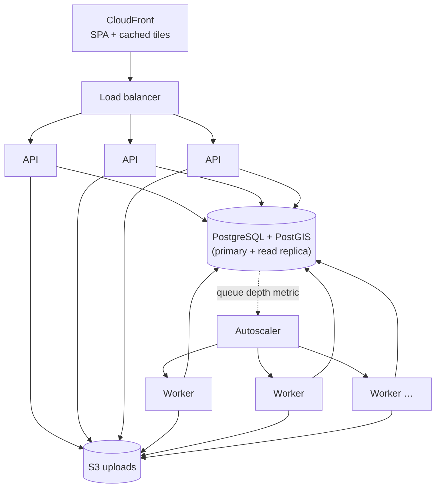

# Scalability and performance

What the submitted system does today, where it would bottleneck, and how it scales — with the measured numbers
separated from the projections.

## Measured

| Measurement | Result | Source |
|---|---|---|
| Pipeline throughput, 100,000 polygons (Shapefile), local equal-area strategy | **~7,400 features/s** (13.4 s) | `tests/performance/test_throughput.py` |
| Same, UTM strategy | ~7,300 features/s (13.6 s) | same |
| Small KML end to end (13 features, upload → worker → Supabase) | ~1.0 s processing | browser test |
| Initial frontend bundle | 452 kB (146 kB gzip); map bundle lazy-loaded | `npm run build` |

Pipeline numbers are one process on a Windows laptop, excluding database writes (which go over the network to
Supabase in development and dominate wall-clock time for remote databases).

## How each part scales

### CPU: processing
* Work per batch is vectorised (Shapely 2 ufuncs, pyproj array transforms) and grouped by projection, so the cost is
  dominated by GEOS/PROJ C code, not Python loops.
* One job per worker **process**; throughput scales linearly with worker processes/containers because claims use
  `SKIP LOCKED` and jobs are independent.

### Memory
* Shapefiles are streamed in Arrow batches of 5,000 features: memory is bounded by the batch, not the file.
* KML is parsed in memory by GDAL (driver limitation) — bounded by `MAX_UPLOAD_BYTES` (100 MiB).
* Uploads are spooled to disk, never held in memory; ZIP extraction streams with a byte budget.

### Database
* Feature rows are inserted per batch with `executemany` (SQLAlchemy's insertmanyvalues batching).
* Reads use keyset pagination on indexed columns — page 10,000 costs the same as page 1; counts are computed only on
  the first page.
* File info is O(1): totals and counts are accumulated during processing and stored on the job row.
* Map tiles use the GiST index; finished jobs' tiles are immutable and cacheable (CDN-friendly).
* Partial indexes keep the queue claim fast as finished jobs accumulate.

### Frontend
* No dataset is ever downloaded whole: vector tiles for the map, keyset pages + row virtualisation for the table.

## Scenarios

| Scale | What happens with the current design | What to change |
|---|---|---|
| **100 features** | Milliseconds of processing; `Prefer: wait=10` returns final results synchronously. | Nothing. |
| **10,000 features** | ~1–2 s of CPU; a few seconds end to end. Table and map unaffected. | Nothing. |
| **100,000 features** | ~14 s CPU per worker; DB insert of 100k rows dominates on a remote DB. | Bulk insert via PostgreSQL `COPY` (psycopg 3 supports it) instead of `executemany` — the obvious next optimisation. |
| **1M+ features in one file** | ~2–3 min CPU per worker; the job is a single unit of work, so it cannot use more than one worker. | Split a file into **chunk jobs** (layer/feature ranges via `skip_features`/`max_features`, which the Shapefile driver supports with random access) processed by many workers, then a finalising step that merges summaries. Pre-generate tile caches (or PMTiles) for very large finished jobs. |
| **1 GB / 10 GB files** | Rejected by the 100 MiB limit (by design). | Direct-to-S3 uploads with pre-signed URLs (the API never touches the bytes), multipart upload, processing reading via `/vsis3/`; prefer columnar formats (GeoParquet, FlatGeobuf) for such sizes; keep KML small (DOM-parsed). |
| **Many concurrent uploads** | API stays responsive (validation is cheap, processing is offloaded); queue absorbs bursts. | Scale API replicas behind a load balancer; scale workers on queue depth. |
| **Hundreds of millions of features overall** | One `features` table grows without bound. | Partition `features` by `job_id` (hash) or time; move cold geometries to GeoParquet in object storage and keep only summaries + hot data in PostGIS; retention policy. |

## Horizontal scaling architecture (production design)

* API and workers are stateless (S3 storage, no local state), so both scale horizontally.
* Workers autoscale on `count(*) WHERE status = 'PENDING'` published as a metric (not implemented — a cron/sidecar
  query away).
* Read replicas can serve tiles and measurement pages; the queue stays on the primary.

## Bottleneck summary

| Resource | First bottleneck | Mitigation in place | Next step |
|---|---|---|---|
| CPU | GEOS/PROJ per feature | vectorised, grouped, one job per process | chunked jobs |
| Memory | KML DOM parsing | upload limit, streaming Shapefiles | prefer streaming formats |
| I/O | upload bytes through the API | spooled to disk, streamed to storage | pre-signed direct uploads |
| Database writes | per-batch inserts | batched executemany | `COPY` |
| Database reads | deep pagination, big maps | keyset, MVT + GiST, stored summaries | read replicas, tile cache |
| Serialisation | JSON for large pages | page caps (500 / 200), geometry only on demand | — |
| Frontend | DOM/GeoJSON size | virtualisation, tiles | — |
