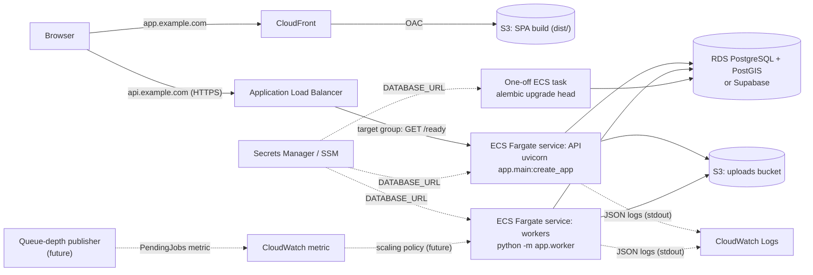

# Production reference deployment (AWS)

> **Status: design, not provisioned.** Nothing in this document has been deployed. The repository contains no
> infrastructure-as-code (no Terraform/CDK/CloudFormation). Each section states what the application code
> supports **today** and what would have to be **added**. Items marked *Not implemented / future* do not exist
> in the codebase.

## Architecture



The API and workers are the same image (`backend/Dockerfile`) with different commands. Both are stateless when
`STORAGE_BACKEND=s3`; all coordination happens in PostgreSQL.

## Supported today vs. to be added

| Concern | Supported by the code today | To be added (not implemented) |
|---|---|---|
| Static frontend | `npm run build` produces `dist/`; `VITE_API_BASE_URL` build-time setting | Bucket, distribution, cache/error policies |
| API behind a load balancer | `--proxy-headers --forwarded-allow-ips *` in the image `CMD`; `/health`, `/ready` | ALB, target group, ECS service |
| Workers | `python -m app.worker`, SIGTERM handling, leases, retries | ECS service, autoscaling |
| Queue-depth autoscaling | Partial index `ix_processing_jobs_claimable` makes the count cheap | Metric publisher, scaling policy |
| Object storage | `STORAGE_BACKEND=s3`, `S3_BUCKET`, `S3_PREFIX`, `S3_REGION`, `S3_ENDPOINT_URL`; boto3 default credential chain | Bucket, IAM task role, lifecycle rules |
| Database | Any PostgreSQL 14+/PostGIS 3+; pooler-safe (`prepare_threshold=None`); dedicated schema | RDS instance or Supabase project, backups |
| Migrations | `alembic upgrade head` in the image | Pipeline step running it as a one-off task |
| Secrets | `DATABASE_URL` is a `SecretStr`; log redaction of secret-named keys | Secrets Manager entry, task-definition `secrets` |
| Logs | `LOG_FORMAT=json` (image default), request/job correlation ids | Log groups, retention, alarms |
| Metrics, tracing | none | CloudWatch metrics/EMF, OpenTelemetry |
| Authentication, rate limiting | **none** (see [../architecture/security.md](../architecture/security.md)) | Required before any public deployment |

## Frontend: CloudFront + S3

```bash
cd frontend
VITE_API_BASE_URL=https://api.example.com npm run build
aws s3 sync dist/ s3://<spa-bucket>/ --delete
```

- Private bucket, CloudFront origin access control.
- Cache policy mirroring `frontend/nginx.conf`: `/assets/*` (content-hashed file names) cached for a year as
  immutable; `index.html` with `no-cache`. `maplibre-gl-worker.mjs` is emitted at the root without a content
  hash, so it needs a short TTL.
- SPA routing (`/files/:id`): map 403/404 from the origin to `/index.html` with status 200 (custom error
  responses), which is what `try_files $uri /index.html` does in nginx.
- Basemap styles load from OpenFreeMap unless `VITE_BASEMAP_STYLE_LIGHT/DARK` point elsewhere; that is an
  external runtime dependency of the map.
- No Content-Security-Policy is defined anywhere today; a CloudFront response-headers policy would add it
  (*future*).

**Alternative:** route `/api/*` through the same CloudFront distribution to the ALB (one origin, as the
Compose nginx does). Then `VITE_API_BASE_URL` stays empty and CORS is not involved. Vector tiles
(`Cache-Control: public, max-age=86400` plus `ETag`) become cacheable at the edge.

## API service: ALB -> ECS Fargate

- Container port 8000, image default command. Restrict the task security group to the ALB, because uvicorn is
  started with `--forwarded-allow-ips *` and trusts `X-Forwarded-*` from any peer.
- Environment: `EMBEDDED_WORKER=false`, `STORAGE_BACKEND=s3`, `S3_BUCKET`, `S3_REGION`, optional `S3_PREFIX`,
  `DB_SCHEMA`, `CORS_ALLOW_ORIGINS='["https://app.example.com"]'` (JSON list; only needed when the SPA calls
  the API cross-origin), `EXPOSE_DOCS` as decided (default `true` exposes `/docs`, `/redoc`, `/openapi.json`).
- `ENVIRONMENT` is accepted by the settings but is not read anywhere in the code; setting it changes nothing.
- ALB idle timeout (default 60 s) must exceed the time to upload `MAX_UPLOAD_BYTES` (100 MiB) on the slowest
  expected client plus any `Prefer: wait=N` (capped at 30 s by `UPLOAD_WAIT_MAX_S`).
- Uploads are spooled to the task's ephemeral storage (once by Starlette's multipart parser, once by the
  upload service while hashing) before being written to S3.

## Worker service

- Same image, command `["python", "-m", "app.worker"]`, no load balancer, no port.
- One job per process; processing is CPU-bound (GEOS/PROJ). Scale by task count, not threads.
- Memory: the KML driver parses the whole document in memory (bounded by the 100 MiB upload limit);
  Shapefiles stream in batches of `PROCESSING_BATCH_SIZE` (5,000). Ephemeral storage must hold a downloaded
  upload plus its extracted Shapefile components (extraction is capped at `MAX_ZIP_UNCOMPRESSED_BYTES`, 1 GiB).
- Do not attach an HTTP health check: the image `HEALTHCHECK` targets the API port and would fail for a
  worker (ECS ignores the Dockerfile `HEALTHCHECK` unless the task definition defines one). Crash recovery is
  built into the queue: a dead worker's lease expires after `WORKER_LEASE_S` (300 s) and the job is reclaimed.
  A worker that is alive but stuck inside one batch is not detected (*future*: heartbeat-based liveness).

### Scaling on queue depth (*Not implemented / future*)

The intended signal is the number of due, unclaimed jobs:

```sql
SELECT count(*) FROM geomeasure.processing_jobs
WHERE status = 'PENDING' AND run_after <= now();
```

The predicate matches the partial index `ix_processing_jobs_claimable`, so the query stays cheap as finished
jobs accumulate. A scheduled task (EventBridge Scheduler -> Lambda, or a small sidecar loop) would publish it
every minute with `PutMetricData` as a custom metric (e.g. namespace `Geomeasure`, metric `PendingJobs`), and an
Application Auto Scaling policy would size the worker service on backlog per task. None of this exists in the
repository.

## Database

| Option | Notes |
|---|---|
| RDS for PostgreSQL | Migration `0001` runs `CREATE EXTENSION postgis` when it is missing; the migration role needs the privilege (e.g. a role granted `rds_superuser`), or PostGIS must be enabled beforehand. |
| Supabase | The configuration used in development (Session pooler, PostGIS in the `extensions` schema). From an IPv4-only VPC use the pooler; the direct host is IPv6-only. |

Each process holds its own pool (`DB_POOL_SIZE=5` + `DB_MAX_OVERFLOW=5`), so peak connections are roughly
`10 x (API tasks + worker tasks)`. The app is designed to be compatible with transaction-mode poolers (no
prepared statements, no session state); RDS Proxy has not been tested. Read replicas are not used by the code.

## Uploads: S3

```bash
STORAGE_BACKEND=s3
S3_BUCKET=<uploads-bucket>
S3_REGION=<region>
S3_PREFIX=prod        # optional
```

Credentials come only from boto3's default chain; on ECS that is the **task role**. No access keys belong in
the environment. Minimal policy for the task role:

```json
{
  "Version": "2012-10-17",
  "Statement": [
    {"Effect": "Allow", "Action": ["s3:GetObject", "s3:PutObject"], "Resource": "arn:aws:s3:::<uploads-bucket>/prod/*"},
    {"Effect": "Allow", "Action": "s3:ListBucket", "Resource": "arn:aws:s3:::<uploads-bucket>"}
  ]
}
```

`s3:ListBucket` is required: `HeadBucket` (readiness check) needs it, and without it S3 answers `HeadObject`
on a missing key with 403 instead of 404, which `S3Storage.exists()` reports as a `StorageError` rather than
"not found", so every first-time upload would fail. The application never deletes objects
(`StorageBackend.delete` exists but is unused), so `s3:DeleteObject` is not needed. Block public access; the
code sets no server-side encryption parameters, so the bucket default (SSE-S3) applies.

## Migrations as a one-off task

Run before updating the services, with the same image, environment and secrets:

```bash
aws ecs run-task --cluster <cluster> --launch-type FARGATE \
  --task-definition <backend-task-def> \
  --overrides '{"containerOverrides":[{"name":"backend","command":["alembic","upgrade","head"]}]}' \
  --network-configuration '<awsvpc config>'
```

The pipeline must wait for exit code 0 and run exactly one migration task at a time (Alembic takes no lock).
Each migration runs in its own transaction (`transaction_per_migration=True`).

### Zero-downtime practice (expand / contract)

Only one migration exists today; this is the practice to follow for the next ones, because old and new task
versions overlap during a rolling deploy and workers may hold jobs across it:

1. **Expand**: add nullable columns, new tables or indexes only. Large indexes need `CREATE INDEX
   CONCURRENTLY`, which must run outside a transaction (Alembic `autocommit_block()`).
2. Deploy code that works with both the old and new schema; backfill in small batches.
3. **Contract** in a later release: drop old columns, add `NOT NULL`/constraints once every running version no
   longer depends on them.

Queue columns (`processing_jobs`) are read by every worker's claim query, so changes there need particular
care. If a change alters results, bump `PROCESSOR_VERSION` (`backend/app/__init__.py`): it is part of the job
fingerprint, so re-uploads are processed again instead of reusing stale results.

## Secrets and configuration

- `DATABASE_URL` in Secrets Manager (or an SSM SecureString), injected as an environment variable via the task
  definition's `secrets`. pydantic-settings reads it from the environment; it is held as a `SecretStr`, and the
  JSON log formatter masks fields named `password`, `secret`, `token`, `authorization`, `database_url`,
  `api_key`.
- Everything else is non-secret configuration (plain environment variables or SSM parameters). There are no
  other secrets: S3 access uses the task role.

## Health checks

| Endpoint | Behaviour | Use |
|---|---|---|
| `GET /health` | Always `{"status":"ok"}`; touches no dependency | ECS container health check (liveness), e.g. the same Python one-liner the Dockerfile uses |
| `GET /ready` | `SELECT 1` on the database and `storage.check()` (S3 `HeadBucket`); 503 with per-check status if either fails | ALB target group health check |

**Why liveness must not depend on the database.** A failed liveness check makes the orchestrator kill and
replace the task. During a database or S3 outage every task would fail it at once; replacing healthy processes
fixes nothing, adds cold starts and connection storms when the database returns, and can cascade into a full
outage of an API that could otherwise still serve `/health` and clear errors. Readiness answers a different
question ("should this task receive traffic now?") and is the right place for dependency checks.

**Caveat.** ECS services attached to a target group also replace tasks that fail the *load balancer* health
check. With `/ready` on the target group, a long database outage would therefore still cause task churn. Keep
the target-group unhealthy threshold and interval tolerant and set a health-check grace period. When every
target is unhealthy the ALB fails open and routes to all of them anyway.

## Logging

Use `LOG_FORMAT=json` (the image default) and the `awslogs` driver. Each line is one JSON object with `ts`,
`level`, `logger`, `msg`, correlation ids (`request_id`, `job_id`, `worker_id`) and structured fields. Example
CloudWatch Logs Insights query:

```text
fields @timestamp, job_id, error_code, retryable, next_status
| filter logger = "app.processing" and msg = "job failed"
| sort @timestamp desc
```

Log retention, metric filters and alarms are *not implemented / future*. Field reference:
[../architecture/observability.md](../architecture/observability.md).

## Graceful shutdown

- Set `stopTimeout` to 30 s on the worker container, matching `stop_grace_period` in Compose (Fargate allows
  up to 120 s).
- On SIGTERM the worker sets a stop flag. Before writing the next batch it raises `JobInterruptedError`, the
  job is released (`PENDING`, `attempts - 1`, `run_after = now()`), and the process exits; the job is picked up
  by another worker without consuming an attempt.
- If SIGKILL arrives first, the lease expires after `WORKER_LEASE_S` and another worker reclaims the job; that
  attempt counts, and the re-run deletes the partial rows before inserting.
- API tasks: ECS deregisters the target and waits for the ALB deregistration delay before SIGTERM; uvicorn
  then finishes in-flight requests. Lower the deregistration delay (default 300 s) to the longest expected
  request.

## Backup and retention

- **Database**: RDS automated backups with point-in-time recovery (retention 1-35 days) or Supabase backups
  (depend on the plan). Nothing in the repository configures them.
- **S3**: enable versioning; add a lifecycle rule for noncurrent versions. Storage keys are content-addressed
  and objects are never overwritten with different bytes, so a database restored to an earlier point in time
  still finds every object it references, as long as objects are never deleted.
- **Application-level retention**: *not implemented*. There are no delete endpoints; `files`, `processing_jobs`,
  `features` and stored uploads grow without bound. A future retention job would delete `files` rows, then
  unreferenced jobs (`features` cascade on job delete; `files -> processing_jobs` is `ON DELETE RESTRICT`), then
  objects whose key no job references.
